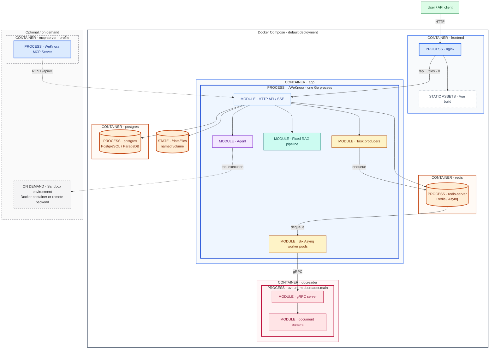
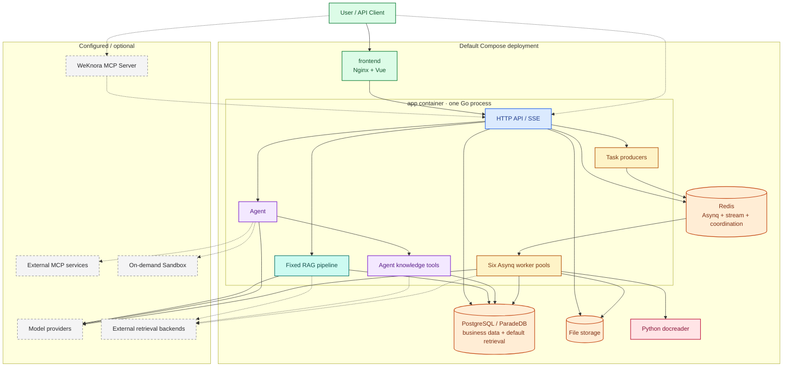
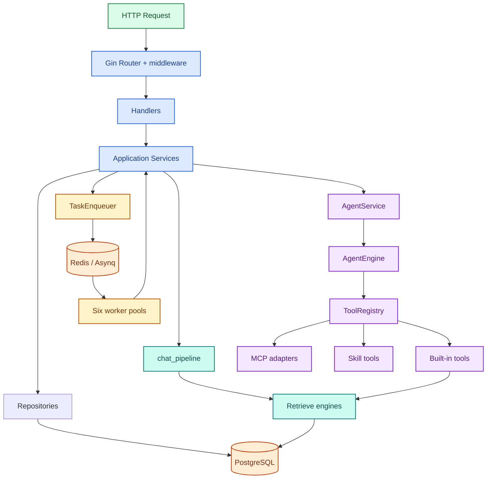
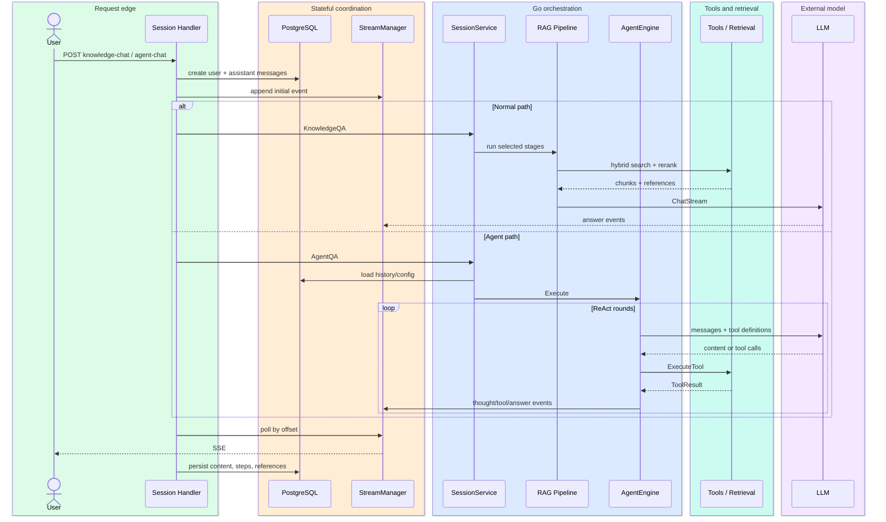
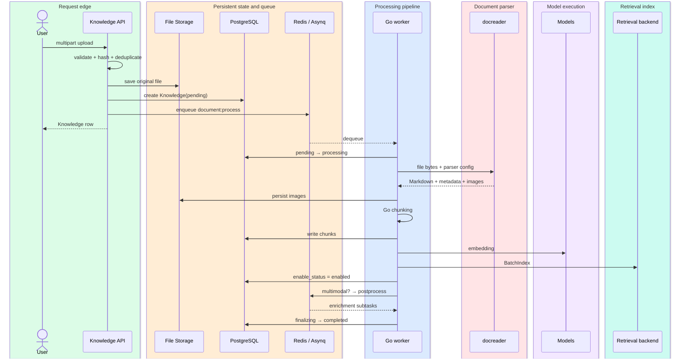

# 拆解 WeKnora：一个生产级 Agent + RAG 系统是如何组织的

最近我在研究 Server-side Agent 的实现。相比只有 Agent Loop 的 SDK，我更想知道一个真正运行在服务端、支持多用户、知识库、异步任务和工具执行的 Agent 系统最终会长成什么样。

WeKnora 是我选择拆解的第一个项目。

这篇先不讨论 Agent Loop、Context 和 Skill 的具体实现，而是从 Docker Compose 和进程入口开始，把整个系统拆开。我想回答的问题只有一个：WeKnora 作为一个可以部署运行的 Agent/RAG 产品，由哪些进程、模块和基础设施组成，它们如何协作？

> 本文基于 WeKnora `main` 分支 commit [`4e25684`](https://github.com/Tencent/WeKnora/tree/4e25684b8ff55a70a55c03730d81457c14521d3c)，版本号 `0.7.2`，研究日期为 2026-08-24。文中的“可能”表示基于源码作出的推断，不代表项目作者公开说明过设计动机。

## 1. WeKnora 是什么

WeKnora 是一个可私有部署的知识管理与问答系统。它包含文档导入、解析、分块和索引，也提供固定流程的知识问答与 ReAct Agent。围绕这两条问答路径，系统还接入了多租户与权限、异步任务、MCP、Skill、Sandbox、外部数据源、Wiki 和多种检索后端。

WeKnora 的完成度非常高。仓库里不只有 Web 聊天页面，还能找到小程序、REST API、CLI、桌面端、Chrome Extension 和网站嵌入 Widget。知识库管理、文档导入和 Agent 问答已经通过这些客户端组成了一套可以实际使用的产品。

前端涉及两套技术栈。Web 使用 Vue 3 和 TypeScript，Vite 负责构建，状态管理使用 Pinia，组件库使用 TDesign，部署后由 Nginx 提供静态页面和 API 反向代理。小程序没有使用跨端框架，而是原生的 JavaScript、WXML 和 WXSS，直接通过 API Key 连接 WeKnora。

后端主要分成 app 和 docreader。app 使用 Go，HTTP 层是 Gin，数据访问使用 GORM。API、Agent、RAG 和异步 worker 都在这个服务里。docreader 使用 Python，通过 gRPC 接收 app 发来的文件，内部使用 MarkItDown、OpenDataLoader、Playwright 等工具处理不同格式的文档。

再往下是 PostgreSQL/ParadeDB、Redis 和文件存储。PostgreSQL 默认不只保存业务数据，也承担全文和向量检索；Redis 用于 Asynq 任务和运行时协调。MCP、Skill、Sandbox、外部模型和其他检索后端则从这些核心服务继续向外扩展。

## 2. 从部署开始

WeKnora 官方 README 推荐使用 Docker Compose 部署。环境只要求安装 Docker、Docker Compose 和 Git。

先拉取代码，并从示例文件创建本地配置：

```bash
git clone https://github.com/Tencent/WeKnora.git
cd WeKnora
cp .env.example .env
```

`.env` 中可以调整镜像版本、端口、数据库、Redis、模型和存储等配置。保持默认配置时，继续拉取镜像并启动核心服务：

```bash
docker compose pull
docker compose up -d
```

启动完成后，Web UI 位于 `http://localhost`，后端 API 位于 `http://localhost:8080`。

我在本文对应的 `v0.7.2` 镜像上实际跑了一次默认部署。为了避开本机已有服务，将 Web UI 映射到 `18081`，将后端 API 映射到 `18080`；其余组件仍然只在 Compose 网络内通信。下面是服务启动后的登录页。


<p class="figure-caption">图 1-1　WeKnora v0.7.2 本地部署后的登录页</p>

登录后，默认工作区把知识库、智能体和对话放在同一套产品界面中。此时数据库里还没有导入任何文档，知识库页面如下。


<p class="figure-caption">图 1-2　尚未导入文档时的知识库页面</p>

智能体页面已经预置快速问答、智能推理、维基问答和数据分析师四种入口。页面上是四种能力入口，但它们在后端并不对应四个独立服务。这个差异要回到 Compose 里才能看清楚。


<p class="figure-caption">图 1-3　默认工作区中的四种智能体入口</p>

默认部署只启动核心组件；需要完整功能时，可以使用 `full` profile：

```bash
docker compose --profile full pull
docker compose --profile full up -d
```

Neo4j、MinIO 和 Langfuse 也有各自的 profile，并且可以组合启动。例如同时启用 Neo4j 和 MinIO：

```bash
docker compose --profile neo4j --profile minio pull
docker compose --profile neo4j --profile minio up -d
```

停止服务使用：

```bash
docker compose down
```

升级时，先在 `.env` 中把 `WEKNORA_VERSION` 改成目标版本，或者继续使用 `latest`，然后重新执行 `docker compose pull` 和 `docker compose up -d`。官方 README 特别提醒，只执行 `up -d` 可能会继续使用本地缓存的旧镜像。

生产环境还需要遵循 README 的安全建议：优先部署在内网或私有网络中，并配置防火墙和访问控制，不要直接把默认服务暴露到公网。

### 为什么先看部署入口

第一次阅读一个 Agent 项目，很容易直接钻进 `internal/agent`，然后把看到的 loop、tool calling 和 prompt 当成整个系统。

但一个可运行产品首先要回答的不是“模型如何思考”，而是另一组问题：请求从哪里进入，解析任务在哪里执行，状态落在哪里，哪些组件能横向扩容，工具代码又被隔离在哪里。

所以我的阅读顺序是：

```text
README
  → docker-compose.yml
  → Dockerfile / env / config
  → cmd/server
  → dependency container
  → handler / service / repository
```

这个顺序很快纠正了几个先入为主的判断：
* WeKnora 没有独立的 worker 服务；
* Sandbox 不是一个常驻执行 daemon；
* Agent 也不是在固定 RAG pipeline 外面套了一层循环。

### 从部署文件看系统

默认执行 `docker compose up -d` 时，核心拓扑只有五类常驻组件。

| Component | Runtime | Process | 主要职责 | 主要依赖 |
|---|---|---|---|---|
| frontend | Nginx + Vue 静态产物 | `nginx` | Web UI、SPA、API 反向代理 | app |
| app | Go | `./WeKnora` | HTTP API、Agent、RAG、业务服务、任务生产与消费 | PostgreSQL、Redis、docreader、模型与存储 |
| docreader | Python 3.10 | `uv run -m docreader.main` | 通过 gRPC 解析文件或 URL，返回 Markdown、metadata 和图片 | 可选解析后端 |
| PostgreSQL / ParadeDB | PostgreSQL 17 | `postgres` | 业务持久化；默认也保存检索与向量索引 | volume |
| Redis | Redis 7 | `redis-server` | Asynq、流式事件恢复和分布式协调 | AOF |

### 运行时进程拓扑

表格列出了组件，但它仍然容易让人误以为 Agent、RAG 和 worker 是几个独立服务。把容器、进程和进程内模块分层之后，默认部署的真实边界如下。



<p class="figure-caption">图 1-4　WeKnora 默认部署的 Container、Process 与 Module 边界</p>

这张图有三种不同的边界：外层实线框是 Container，标有 `PROCESS` 的节点或内层框是操作系统进程，标有 `MODULE` 的节点只是进程内代码模块。虚线边界表示 profile 可选或按需创建，不属于默认常驻拓扑。

app container 只运行一个 `./WeKnora` 进程。HTTP API、Agent、固定 RAG pipeline、任务生产者和六组 Asynq worker pool 都在这个进程里，共享同一套 Service、Repository 和依赖注入容器。扩容 app 副本时，这些职责也会一起扩容。

Sandbox 则位于另一种生命周期里。它是 Tool 执行时按需创建或连接的隔离环境，可以是本地 Docker container，也可以是远程 backend；它不是默认 Compose 中一直运行的 Sandbox daemon。

浏览器通常先访问 frontend。Nginx 返回页面，并把 `/api/`、`/files` 和 `/r/` 转发给 app。客户端也可以直接请求 app 的 8080 端口。

原始文件默认写入 app 的 `/data/files` volume。PostgreSQL 保存用户、租户、知识库、文档、chunk、session、message、Agent 配置、MCP 配置以及异步任务的辅助状态。Redis 则承担 Asynq queue、SSE 事件恢复、分布式锁、并发控制、approval 等待和远程 Sandbox session binding。

默认 Compose 为 PostgreSQL 和文件存储声明了 named volume，却没有为 Redis 声明 named volume。Redis 虽然开启了 AOF，但容器重建后能否保留数据，仍然取决于外部持久卷。

Qdrant、Milvus、Weaviate、Doris、Elasticsearch/OpenSearch、Neo4j、MinIO、SearXNG、Langfuse 和独立 MCP Server 都是按 profile 或配置接入的可选组件。它们不应该被无条件画进最小部署图。

部署事实主要来自 [`docker-compose.yml`](https://github.com/Tencent/WeKnora/blob/4e25684b8ff55a70a55c03730d81457c14521d3c/docker-compose.yml)、[app Dockerfile](https://github.com/Tencent/WeKnora/blob/4e25684b8ff55a70a55c03730d81457c14521d3c/docker/Dockerfile.app)、[docreader Dockerfile](https://github.com/Tencent/WeKnora/blob/4e25684b8ff55a70a55c03730d81457c14521d3c/docker/Dockerfile.docreader) 和 [Nginx 配置](https://github.com/Tencent/WeKnora/blob/4e25684b8ff55a70a55c03730d81457c14521d3c/frontend/nginx.conf)。

## 3. 整体架构

下面这张图刻意把“部署组件”和“app 内部模块”画在不同边界里。



<p class="figure-caption">图 1-5　WeKnora 默认组件与可选组件的整体架构</p>

图中的 HTTP API、Agent、固定 RAG pipeline、任务生产者和六组 worker pool 都落在 app 这一个 Go 进程里。图上虽然分成多个节点，部署时却不是五个服务。

默认检索后端也不是一台独立向量数据库，而是 PostgreSQL/ParadeDB。外部 vector/search backend 只有在配置后才进入链路。

## 4. Go 主服务内部如何组织

app 使用依赖注入容器统一装配基础设施、repository、service、handler、router 和后台 runner。入口位于 [`cmd/server`](https://github.com/Tencent/WeKnora/tree/4e25684b8ff55a70a55c03730d81457c14521d3c/cmd/server)，主要装配过程位于 [`internal/container/container.go`](https://github.com/Tencent/WeKnora/blob/4e25684b8ff55a70a55c03730d81457c14521d3c/internal/container/container.go)。



<p class="figure-caption">图 1-6　Go 主服务内部的模块与依赖关系</p>

### API 层

Gin Router 在 `/api/v1` 下注册业务路由，并叠加认证、API Key capability、租户和 RBAC middleware。Handler 负责 HTTP 协议、权限入口、参数解析和 SSE；业务链路继续下沉到 Service。

### Agent

核心执行引擎位于 `internal/agent`，但一次 Agent 请求并不是直接从 Handler 跳到 Engine。

`sessionService.AgentQA` 先从数据库加载历史和 CustomAgent 配置，解析模型、知识范围、附件与记忆。`agentService.CreateAgentEngine` 再为当前 turn 创建新的 ToolRegistry，注册内置工具、MCP tools 和 Skill tools，最后创建 AgentEngine。

源码注释明确说明 Engine 跨 turn 无状态。历史由每次请求从 PostgreSQL 重建，再作为 `llmContext` 传入执行。

### Knowledge / RAG

普通问答使用 `internal/application/service/chat_pipeline`。pipeline 不是一个永远不变的列表：pure chat 只加载历史、召回记忆并调用模型；具备 KB scope 或 web search 时，才加入 query understanding、并行检索、rerank、merge 和 prompt assembly。

Agent 模式没有复用这条顶层 pipeline。知识检索被包装成 `knowledge_search` 等工具，由 Agent 决定何时调用。两条路径共享 KnowledgeService、retrieval engine 和模型适配，但各自编排检索与 rerank。

### Async Task

标准模式使用 Redis + Asynq。app 启动时创建六个独立 Asynq server pool：core、postprocess、enrichment、maintenance、shared 和 wiki。每个 pool 有独立 concurrency，shared pool可以消费 core/enrichment 队列，给突发任务借用容量。

这已经具备任务级的容量隔离，但没有进程级隔离。扩一个 app 副本，也会一起扩六组 worker。源码入口可见 [`internal/router/task.go`](https://github.com/Tencent/WeKnora/blob/4e25684b8ff55a70a55c03730d81457c14521d3c/internal/router/task.go) 和 [`internal/types/task.go`](https://github.com/Tencent/WeKnora/blob/4e25684b8ff55a70a55c03730d81457c14521d3c/internal/types/task.go)。

## 5. 一次问答如何运行

WeKnora 暴露两条主要入口：

```text
POST /api/v1/knowledge-chat/:session_id
POST /api/v1/agent-chat/:session_id
```

两条路由最后都会进入统一的 `executeQA`。它先创建 user message 和空 assistant message，再建立 EventBus、StreamManager 和异步执行 context。真正的生成在 goroutine 中运行，当前 HTTP handler 则轮询 StreamManager，把事件持续写成 SSE。



<p class="figure-caption">图 1-7　普通问答与 Agent 问答的请求、执行和事件流</p>

### Normal path

RAG 场景的实际主干是：

```text
LOAD_HISTORY?
→ MEMORY_RECALL
→ QUERY_UNDERSTAND
→ CHUNK_SEARCH_PARALLEL
→ CHUNK_RERANK
→ WEB_FETCH?
→ CHUNK_MERGE
→ FILTER_TOP_K
→ DATA_ANALYSIS?
→ INTO_CHAT_MESSAGE
→ CHAT_COMPLETION_STREAM
```

`CHUNK_SEARCH_PARALLEL` 内部并行执行 chunk search 和 entity search。chunk search 又会按实际 embedding model 对 SearchTargets 分组，尽量复用 query embedding，并通过 KnowledgeBaseService 选择对应 retrieval engine。

### Agent path

AgentService 每轮创建 ToolRegistry。`knowledge_search`、web search、MCP tools、Skill tools 等是否注册，取决于 Agent allowlist、知识库能力和租户配置。LLM 获得 tool definitions 后进入 Agent loop，ToolRegistry 负责参数转换、JSON Schema 校验和执行。

从这两条调用链看，Agent 并没有包在固定 RAG pipeline 外面。普通问答由 pipeline 决定何时检索，Agent 问答则由模型决定是否调用知识工具。

### HTTP 断开以后

HTTP/SSE 断开不会取消正在进行的生成。

`logger.CloneContext` 从 `context.Background()` 创建新 context，只复制允许跨 detach 的身份、租户和 tracing 信息。SSE 连接断开后，发送循环退出，但生成仍继续，最终结果照常持久化。

真正的用户取消走另一条路径：stop 接口向共享 StreamManager 写 marker；一个不依赖 SSE 连接的 watcher 发现 marker 后向 EventBus 发 stop，再取消生成 context。相关实现位于 [`qa.go`](https://github.com/Tencent/WeKnora/blob/4e25684b8ff55a70a55c03730d81457c14521d3c/internal/handler/session/qa.go)、[`stream.go`](https://github.com/Tencent/WeKnora/blob/4e25684b8ff55a70a55c03730d81457c14521d3c/internal/handler/session/stream.go) 和 [`helpers.go`](https://github.com/Tencent/WeKnora/blob/4e25684b8ff55a70a55c03730d81457c14521d3c/internal/handler/session/helpers.go)。

## 6. 一个文档如何进入知识库

文件上传入口是：

```text
POST /api/v1/knowledge-bases/:id/knowledge/file
```

Handler 解析 multipart 表单并校验权限、文件大小和处理配置。KnowledgeService 计算文件 hash 做去重，检查配额，然后按下面的顺序写入：

```text
原文件写 FileService
→ Knowledge(pending) 写 PostgreSQL
→ document:process 写入 Asynq default queue
```

如果数据库创建失败，Service 会尝试删除已经保存的文件。如果任务入队失败，文件和 Knowledge row 会保留，但状态被更新为 `failed`，接口仍返回这个 row，给调用者保留重试入口。



<p class="figure-caption">图 1-8　文档从上传到完成索引与后处理的调用链</p>

### Python 负责解析，Go 负责入库

Go worker 读取原文件并构造 `ReadRequest`，再根据 parser engine 选择具体 DocReader。默认远程 reader 通过 gRPC 调 Python docreader。返回值包含 Markdown、metadata 和图片引用；docreader 不保存最终 chunk 和 index。

Go app 接收结果后保存图片并改写 Markdown 引用，再调用 Go chunker。parent-child 模式会同时创建 parent 和 child chunks，但只有可检索的 child/flat text chunks 进入 embedding 与 `BatchIndex`；parent chunks保存在 PostgreSQL，用于召回后的上下文扩展。

主链可见 [`knowledge_create.go`](https://github.com/Tencent/WeKnora/blob/4e25684b8ff55a70a55c03730d81457c14521d3c/internal/application/service/knowledge_create.go) 与 [`knowledge_process.go`](https://github.com/Tencent/WeKnora/blob/4e25684b8ff55a70a55c03730d81457c14521d3c/internal/application/service/knowledge_process.go)。

### 可检索不等于全部完成

索引成功后，`processChunks` 会把 `enable_status` 更新为 `enabled`。文档此时已经可以进入检索，但 `parse_status` 通常仍是 `processing`。

没有多模态任务时，系统立即入队统一的 postprocess；有图片 OCR/caption 时，每张图先进入 multimodal queue，全部结束后再进入 postprocess。

Postprocess 统计需要执行的 summary、question batch、graph chunk 和 wiki ingest 任务。如果没有这些任务，Knowledge 直接变成 `completed`；否则它先原子进入 `finalizing`，并写入 `pending_subtasks_count`。每个子任务在成功或耗尽 retry 后释放一个 slot，最后一个 slot 通过 guarded update 把状态提升为 `completed`。

所以这条链路存在两个“Ready”：

- chunks 和 index 已写入，文档可以参与检索；
- 所有计入完成门闩的 enrichment 都已终止，`parse_status=completed`。

最终门闩实现在 [`knowledge_post_process.go`](https://github.com/Tencent/WeKnora/blob/4e25684b8ff55a70a55c03730d81457c14521d3c/internal/application/service/knowledge_post_process.go) 和 [`knowledge repository`](https://github.com/Tencent/WeKnora/blob/4e25684b8ff55a70a55c03730d81457c14521d3c/internal/application/repository/knowledge.go)。

## 7. 几个实现取舍

### Go 与 Python 的边界落在文档解析

docreader 镜像需要 LibreOffice、Playwright WebKit、OpenJDK 和 antiword。把它与 Go app 分开，可能是为了利用文档处理生态，也隔离体积、资源消耗和失败模式都不同的解析任务。

我会保留这种拆法。docreader 的系统依赖、镜像体积和资源消耗都与 Go app 不同，把它单独部署可以隔离解析任务；代价是多出一套 gRPC、timeout、镜像和健康检查。

### 异步架构已经分池，但没有分进程

六组 Asynq pool 对不同任务做了硬并发隔离，shared pool 还允许 core/enrichment 借用空闲能力。任务拥塞时，core、postprocess、enrichment 和 wiki 不会只依赖一组队列权重争抢同一份并发。

但 API 与 worker 仍是同一个扩容单位。增加 app 副本会同时增加在线请求容量和后台 worker concurrency。对默认私有部署这是很实际的简化；如果要做大规模生产部署，我会先研究能否增加明确的 process role，让 API 和 worker 独立扩容。

### Agent/RAG 是两套 orchestration，共享底层能力

固定 pipeline 给快速问答一条确定的检索路径；Agent 则把检索注册成可选工具。两种模式共享底层检索能力，但各自维护顶层编排。

需要留意的是，两边分别实现检索编排、rerank 和结果整理。它们共享 KnowledgeService 和 retrieval engine，却不共享顶层 pipeline。长期演进时，同一个知识库在两种问答模式下可能出现行为差异。

### Sandbox 是按需执行边界

Compose 中的 `sandbox` service 只负责准备镜像，命令执行后立即退出。真正的 Docker Sandbox 在工具调用时按需创建；远程 E2B-compatible 或 Cube backend 则按 session 连接与绑定。

所以最小部署图里不应该再画一个常驻 Sandbox 服务。它只在 Agent 调用 Skill 或 shell 时成为隔离执行环境。相关入口位于 [`internal/sandbox`](https://github.com/Tencent/WeKnora/tree/4e25684b8ff55a70a55c03730d81457c14521d3c/internal/sandbox) 和 [`container/sandbox.go`](https://github.com/Tencent/WeKnora/blob/4e25684b8ff55a70a55c03730d81457c14521d3c/internal/container/sandbox.go)。

## 8. 我暂时没有搞清楚的问题

这次已经能确定：HTTP 断开后 Agent 继续执行，消息、steps 和 references 最终会写入 PostgreSQL。但这还不等于 durable execution。

我暂时保留下面几个问题：

- app 进程崩溃后，进行中的 Agent run 是否能从 checkpoint 恢复？目前没有找到 Agent loop 持久化执行游标的证据。
- 多个 app 副本同时启动六组 worker 时，全局模型并发和后台容量如何预算？
- Redis 容器重建丢失队列或 stream 后，哪些任务能从 PostgreSQL 自动补发？
- MCP approval 和 OAuth 等待能否跨 app 重启恢复？
- remote Sandbox 的租约、回收和重连边界是什么？
- 两套 RAG orchestration 如何避免检索行为长期漂移？
- 文档已经 `enable_status=enabled`，但后续 enrichment 最终失败时，产品应如何向用户表达“可检索但未完整完成”？

这些问题不适合在架构总览里顺手猜完。下一篇我会进入 `internal/agent`，先看 Agent loop 的运行模型，再回答其中与执行状态有关的部分。

## 9. 总结

第一遍看产品页面时，我以为这些能力背后会有多组独立服务。Compose 和进程入口给出的答案更集中：一个承担大部分控制与业务逻辑的 Go app，加上 Python docreader、PostgreSQL、Redis 和文件存储。

app 内部同时存在两条问答路径：固定 chat pipeline 与按 turn 创建的 AgentEngine。它们共享知识与模型基础设施，但以不同方式决定何时检索。文档 ingestion 则从 Go app 内的 Asynq worker 出发，跨过 docreader、chunk、embedding/index、多模态和 postprocess，最后用 PostgreSQL 中的计数门闩确定完整完成。

下一篇继续进入 `internal/agent`，先看这个按 turn 创建的 AgentEngine 如何完成一次 ReAct 执行。
