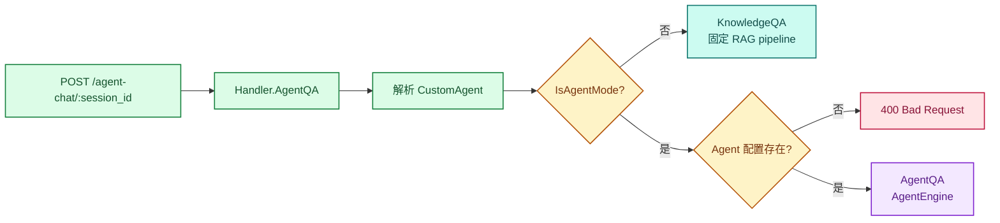
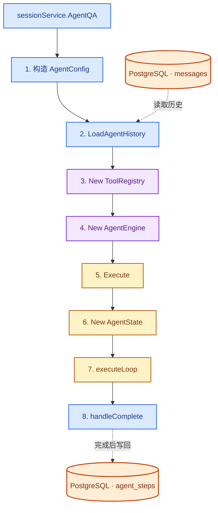
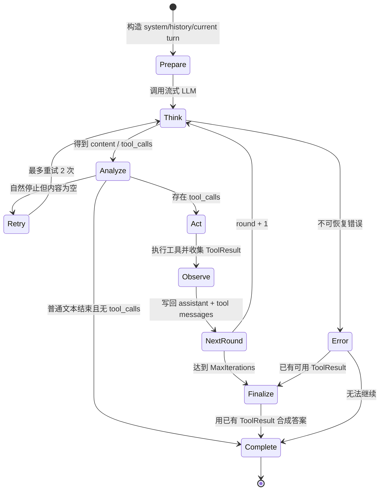
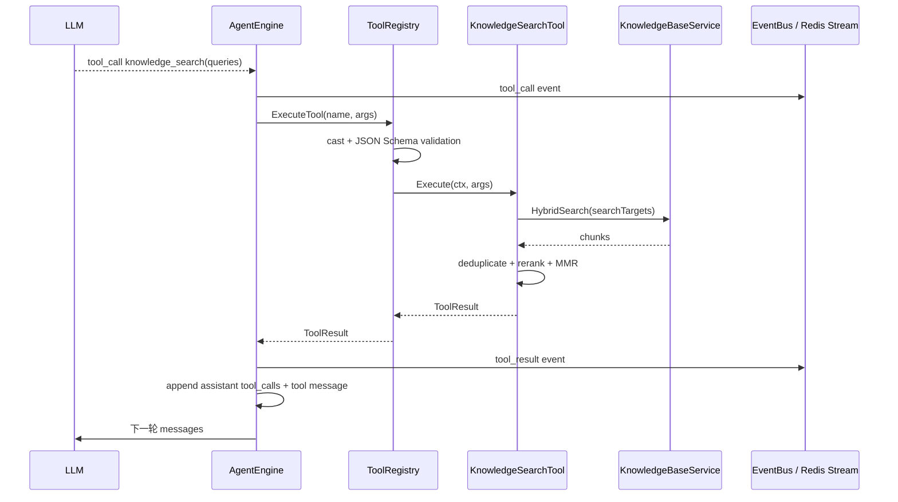
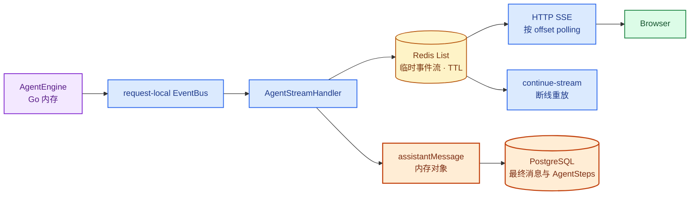

# 拆解 WeKnora Agent：一次 ReAct 执行是如何跑起来的

上一篇从 Docker Compose 开始，把 WeKnora 的进程和模块拆开。最后落到 Go app 内部的两条问答路径：快速问答走固定 RAG pipeline，智能推理则为当前请求创建一个 AgentEngine。

这一篇继续往 `internal/agent` 走。我想搞清楚的不是 ReAct 概念本身，而是它放进一个多用户服务以后怎么运行：谁创建 Engine，历史从哪里来，Tool 怎么接进去，流式事件如何到达前端，HTTP 断开以后又会发生什么。

Context compaction、Skill、MCP 和 Sandbox 暂时只看到接入边界，不展开内部实现。

> 本文基于 WeKnora `main` 分支 commit [`4e25684`](https://github.com/Tencent/WeKnora/tree/4e25684b8ff55a70a55c03730d81457c14521d3c)，版本号 `0.7.2`，研究日期为 2026-08-24。

## 1. 两种问答在 Handler 分流

Agent 请求从 `POST /agent-chat/:session_id` 进入 [`Handler.AgentQA`](https://github.com/Tencent/WeKnora/blob/4e25684b8ff55a70a55c03730d81457c14521d3c/internal/handler/session/qa.go)。这个 route 不代表请求一定进入 Agent Loop。

Handler 会先解析当前 CustomAgent。`customAgent.IsAgentMode()` 的结果优先于 request 中的 `AgentEnabled`：Agent mode 开启时进入 `qaModeAgent`，关闭时仍然回到普通的 KnowledgeQA。Agent mode 已开启但没有找到对应 Agent 配置，则在 Handler 直接返回 400。



<p class="figure-caption">图 2-1　Agent 请求在 Handler 中的问答模式分流</p>

两条路径随后进入同一个 [`executeQA`](https://github.com/Tencent/WeKnora/blob/4e25684b8ff55a70a55c03730d81457c14521d3c/internal/handler/session/qa.go)。这里先创建 user message 和 assistant message，再建立 SSE，最后在 goroutine 中调用相应 service。也就是说，Agent 真正开始执行之前，数据库里已经有了本轮问答的两条 message 记录。

## 2. AgentEngine 不是常驻会话对象

[`sessionService.AgentQA`](https://github.com/Tencent/WeKnora/blob/4e25684b8ff55a70a55c03730d81457c14521d3c/internal/application/service/session_agent_qa.go) 会解析本轮 AgentConfig、模型、知识库范围、附件和多轮历史，然后调用 [`CreateAgentEngine`](https://github.com/Tencent/WeKnora/blob/4e25684b8ff55a70a55c03730d81457c14521d3c/internal/application/service/agent_service.go)。

每个 turn 都会重新创建：

- ToolRegistry；
- AgentEngine；
- AgentState；
- request-local EventBus；
- 当前模型调用使用的 messages。

Engine 不保存跨 turn 的会话缓存。多轮历史由 [`LoadAgentHistory`](https://github.com/Tencent/WeKnora/blob/4e25684b8ff55a70a55c03730d81457c14521d3c/internal/application/service/agent_history.go) 从 PostgreSQL 的 messages 表重新组装，再作为 `llmContext` 传入 `AgentEngine.Execute`。

按一次 Agent turn 的实际调用顺序展开，就是下面这条链路：



<p class="figure-caption">图 2-2　一次 Agent turn 中 Engine、State 与 PostgreSQL 的调用顺序</p>

Session 持久化，AgentEngine 则只处理当前 turn。请求结束后，下一 turn 不会复用这个 Engine。

## 3. 一次执行有哪些状态

[`AgentEngine.Execute`](https://github.com/Tencent/WeKnora/blob/4e25684b8ff55a70a55c03730d81457c14521d3c/internal/agent/engine.go) 创建的 `AgentState` 很直接：

```go
type AgentState struct {
    CurrentRound  int
    RoundSteps    []AgentStep
    IsComplete    bool
    FinalAnswer   string
    KnowledgeRefs []*SearchResult
}
```

`AgentStep` 对应一轮模型调用，保存本轮 Thought、ReasoningContent、ToolCalls 和时间。ToolCall 继续保存参数、结果、耗时和 provider metadata。

这些结构足够记录一次运行发生过什么，但它们在 Loop 运行期间都在 Go 内存里。WeKnora 会在完成事件到达 Handler 后，把整理过的 AgentSteps 写进 assistant message；它没有在每一轮结束后单独保存一个 Agent run checkpoint。

## 4. ReAct Loop 实际怎么转

主循环位于 [`executeLoop`](https://github.com/Tencent/WeKnora/blob/4e25684b8ff55a70a55c03730d81457c14521d3c/internal/agent/engine.go)。每一轮由 `runReActIteration` 执行，源码中的顺序就是 Think、Analyze、Act、Observe。



<p class="figure-caption">图 2-3　WeKnora Agent 的 ReAct Loop 状态变化</p>

这里没有 `final_answer` Tool。模型结束一次 Agent turn 的方式，是返回普通 assistant 文本，并且不再请求 Tool Call。`final_answer` 只出现在旧版本历史数据的兼容过滤逻辑里。

有 Tool Call 时，本轮还没有结束。Engine 把模型返回的 assistant message、tool_calls 和每个 Tool Result 按 OpenAI tool-calling 的消息格式追加到当前 messages，然后进入下一轮 LLM。

## 5. Loop 如何避免一直转下去

MaxIterations 来自 CustomAgent 配置。CustomAgent 默认值是 10；运行时拿到小于等于 0 的值时会改成 5，service 层的硬上限是 100。

除此之外还有几层保护：

- 单次 LLM 调用默认最多 120 秒；
- 普通 Tool 默认最多执行 60 秒；
- `shell_exec` 单独允许约 10 分钟；
- rate limit、5xx、timeout 等瞬时 LLM 错误最多重试两次；
- 模型自然停止却没有给出内容时，最多追加两次提示重新请求；
- 没有 Tool Call、内容又连续重复时，提前终止 stuck loop；
- 达到最大轮数仍未结束时，再用已有 Tool Result 合成一次最终回答。

最后一条不是继续 Loop，而是进入 [`handleMaxIterations`](https://github.com/Tencent/WeKnora/blob/4e25684b8ff55a70a55c03730d81457c14521d3c/internal/agent/finalize.go)。它重新构造一组只用于总结的 messages，让 LLM 根据已经取得的结果回答用户。

## 6. ToolRegistry 在每个 turn 重新组装

[`CreateAgentEngine`](https://github.com/Tencent/WeKnora/blob/4e25684b8ff55a70a55c03730d81457c14521d3c/internal/application/service/agent_service.go) 先创建空 ToolRegistry，再调用 `registerTools`。

工具不是把系统里所有能力一次性塞给模型。注册过程先读取 Agent allowlist，然后根据当前请求的实际能力继续过滤：

- 没有 Knowledge scope，就移除知识库相关 Tool；
- 没有 vector/keyword KB，就不注册 RAG Tool；
- 没有 Wiki KB，就不注册 Wiki Tool；
- Web Search 开启时才增加 web_search 和 web_fetch；
- 共享 Agent 的只读模式会移除写入源工作区的 Tool；
- Memory、MCP、Skill 也各自按照当前配置接入。

Registry 对重名 Tool 使用 first-wins。Tool definitions 在发给模型前按名称排序，避免 Go map 的随机遍历顺序改变 prompt prefix。

真正执行前，[`ToolRegistry.ExecuteTool`](https://github.com/Tencent/WeKnora/blob/4e25684b8ff55a70a55c03730d81457c14521d3c/internal/agent/tools/registry.go) 还会修正常见参数类型、执行 JSON Schema 校验，并限制 Tool output 大小。Tool 返回失败时，错误结果也会写回模型，让下一轮决定是否换一种方法。

## 7. 一次 knowledge_search 调用

以 `knowledge_search` 为例，LLM 只负责给出 Tool 名和参数。权限范围、检索后端和真正的 KB ID 都已经在创建 Tool 时绑定。



<p class="figure-caption">图 2-4　一次 knowledge_search Tool Call 的执行顺序</p>

[`KnowledgeSearchTool.Execute`](https://github.com/Tencent/WeKnora/blob/4e25684b8ff55a70a55c03730d81457c14521d3c/internal/agent/tools/knowledge_search.go) 会检查输入的 KB 是否仍在当前 SearchTargets 内。随后按 query 和 embedding model 对检索任务分组，调用 HybridSearch，再做去重、rerank 和 MMR。

它返回两份信息：`Output` 是给下一轮 LLM 阅读的检索结果，`Data` 是给 UI 和历史存储使用的结构化数据。带 `display_type=search_results` 的结果在持久化时不会把整份原始 Output 重复保存，而是保留结构化结果和压缩摘要。

### 多个 Tool Call 怎么执行

模型一次可以返回多个 Tool Call。`ParallelToolCalls` 开启且本轮至少有两个调用时，Engine 使用 errgroup 并行执行；否则按模型返回顺序串行执行。

并行执行不会因为一个 Tool 失败就取消其他 Tool，结果仍按模型原始顺序写入 AgentStep。这里的“并行”是单轮内部的 Tool 并行，不是多个 Agent turn 的调度系统。

## 8. EventBus 如何把执行过程送到前端

Engine 不直接写 HTTP Response。它把 thought、tool_call、tool_result、final_answer、error 和 complete 等事件发到本次请求独享的 EventBus。

[`AgentStreamHandler`](https://github.com/Tencent/WeKnora/blob/4e25684b8ff55a70a55c03730d81457c14521d3c/internal/handler/session/agent_stream_handler.go) 订阅这些事件，再写进 StreamManager。默认 Redis 实现使用 List：`RPUSH` 追加事件，`LRANGE` 按 offset 读取，key 默认保留 24 小时。

HTTP SSE handler 每 100ms 拉一次新事件，然后推给浏览器。`continue-stream` 使用同一份 Redis 数据重放已经产生的事件，并继续等待 complete。



<p class="figure-caption">图 2-5　Agent 执行事件、Redis Stream 与 PostgreSQL 的状态归属</p>

Redis 保存的是交互过程，PostgreSQL 保存的是完成后的会话事实。它们承担的不是同一种状态。

## 9. AgentSteps 什么时候写进数据库

`executeLoop` 用 defer 保证每条退出路径最终发送一次 `EventAgentComplete`。`handleComplete` 收到以后，把 final answer、duration、references、AgentSteps 和产物整理到 assistantMessage。

外层 Agent goroutine 的 defer 再调用 `completeAssistantMessage`，把 assistantMessage 更新到 PostgreSQL。这个 update 使用 `context.WithoutCancel`，即使用户刚刚点击停止，已经得到的内容和步骤仍然可以写入数据库。

下一轮开始时，`LoadAgentHistory` 只读取已经完成的 user/assistant pair。历史 AgentSteps 会重新展开为：

```text
user
assistant + tool_calls
tool result
assistant + tool_calls
tool result
assistant final answer
```

默认情况下，旧的知识库检索正文会被替换成简短标记，避免知识库更新或切换以后，模型继续引用上一个 turn 的旧检索结果。

## 10. HTTP 断开、主动停止与进程崩溃

这部分是我最想确认的。

### 浏览器断开

SSE polling 使用 HTTP request context。浏览器断开后，这个循环退出，但 Agent goroutine 使用的是 `setupSSEStream` 创建的另一个 `asyncCtx`。因此普通网络断开不会自动停止 Agent。

如果用户重新连接 `continue-stream`，可以从 Redis 中重放已经产生的事件。

### 用户点击停止

停止请求不会直接拿到原 goroutine 的 cancel function。它先向 Redis StreamManager 写入一个 stop event。独立 stop watcher 读到这个事件后，通过 EventBus 触发 `cancel()`，Agent Loop 在 LLM、Tool 或下一轮入口观察到 context cancellation 后退出。

取消时已有的 partial step 会尽量保留，最终 message update 使用 WithoutCancel 完成。

### app 进程崩溃

这是另一条边界。当前 AgentState、CurrentRound 和本轮尚未完成的 RoundSteps 都在 Go 内存里。我没有找到 Agent run 表、round cursor 或 checkpoint/replay protocol。

因此目前能确认的是：

> WeKnora 的 Agent 执行脱离了 HTTP 连接生命周期，但没有脱离 app 进程生命周期。

它支持断线继续和事件重放，不等于 app 崩溃后从上一轮 Tool Call 继续执行。

## 11. 几个实现取舍

### Engine 按 turn 创建

每次都从数据库加载历史、重新计算能力范围并创建 ToolRegistry。Agent 配置、共享权限、KB scope 或 MCP 状态发生变化时，下一 turn 会直接使用新状态，不需要再同步一个长期存活的 Engine。

代价也很直接：Tool 注册、历史重建和部分外部连接准备会进入每个 turn 的启动成本。

### 事件流与最终记录分开

Redis 保存进行中的事件，供前端按 offset 拉取和重放；PostgreSQL 只在完成阶段接收整理后的 canonical message。HTTP 断线因此不会影响执行，每个流式 token 也不需要立即写入主数据库。

但本轮完整 AgentSteps 在完成阶段才统一写回。app 在中间崩溃时，Redis 里可能还有部分事件，PostgreSQL 里却只有一条未完成的 assistant message。

### Tool 可见性在执行前收窄

Tool allowlist 不是唯一门槛。WeKnora 还会按 KB capability、共享权限和运行配置继续过滤，Tool 自身绑定已经授权的 SearchTargets。模型只能在这份范围内选择工具，不能通过参数传入任意 KB ID 绕过 scope。

### 当前实现没有 Durable Execution

我会把它称为 connection-independent execution。它解决了浏览器断开、SSE 重连和用户主动停止，但没有证明进程故障恢复、step 幂等重放或 Tool Call exactly-once。

现有 message ID 和 AgentSteps 还不足以恢复中断位置。要支持进程重启后的续跑，还需要明确 Agent run identity、持久化 step cursor，并规定 Tool 重放时如何保证幂等；这些结构在当前调用链中都没有找到。

## 12. 暂时不展开的问题

- Context 超过预算以后具体保留什么、压缩什么？
- Skill metadata、`read_skill` 和脚本执行如何完成渐进披露？
- MCP approval 与 OAuth 等待状态如何存储，能否跨 app 重启？
- remote Sandbox 的 session binding 与 Agent turn 是什么关系？
- 多个 app 副本下，谁保证同一条未完成 message 不被重复执行？

这些问题里，Context 已经直接影响每一轮发给模型的 messages。下一篇可以沿 `internal/agent/token` 和 `internal/agent/memory` 继续追。

## 13. 总结

WeKnora 没有为每个会话保留一个常驻 Agent。每个 turn 从 PostgreSQL 重建历史，创建新的 ToolRegistry、AgentEngine 和 AgentState，然后在 Go 内存里完成多轮 LLM 与 Tool 交互。

执行过程通过 EventBus 写入 Redis，再由 SSE 推给前端；完整回答和 AgentSteps 在结束时写回 PostgreSQL。HTTP 连接可以中断，用户也可以通过 Redis stop event 取消执行，但 app 进程一旦退出，当前 Loop 没有 checkpoint 可以恢复。

下一篇继续追这些 messages：它们怎样从 PostgreSQL 恢复，超过 Token 预算后又会被怎样处理。
