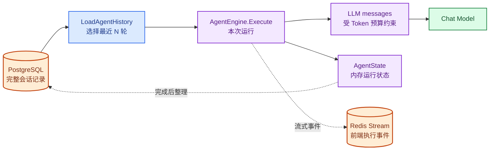
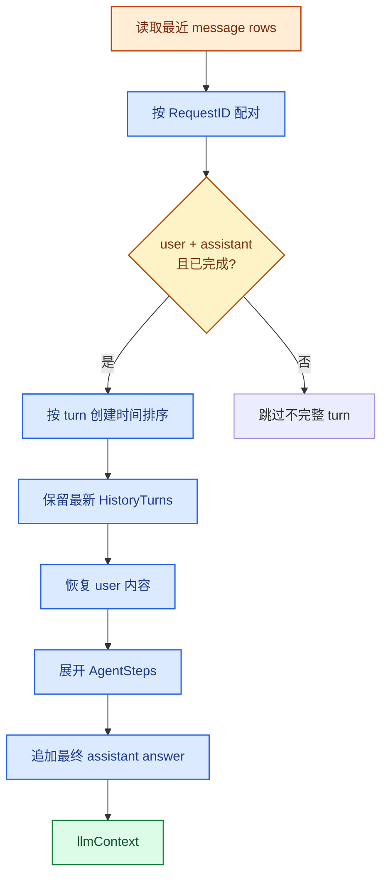
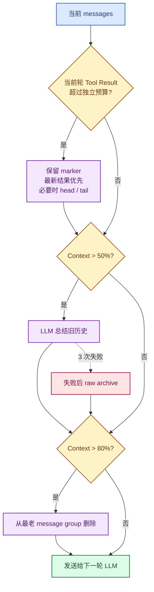
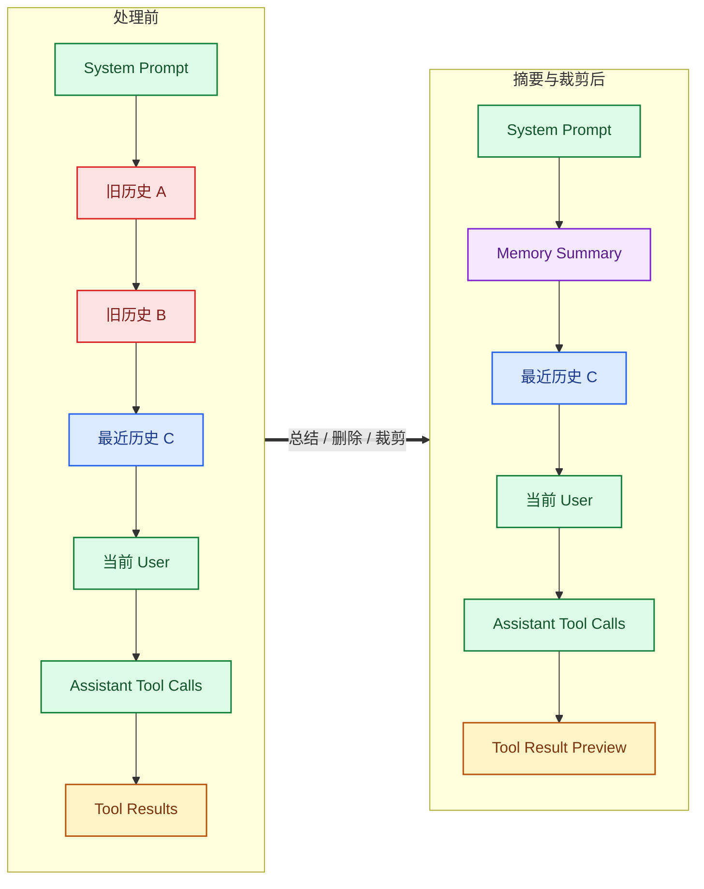

# 拆解 WeKnora Context：Agent 的历史、Token 预算与压缩如何工作

上一篇把 AgentEngine 的执行过程拆开以后，留下了一个没有继续追的问题：ReAct Loop 每一轮都在调用模型，但它发给模型的 `messages` 到底装了什么？

这个问题不能只看一段聊天记录。一个已经执行过几轮 Tool 的 Agent，请求里同时存在 System Prompt、多轮对话、历史 Tool Call、当前知识库范围、附件和刚刚返回的 Tool Result。它们的来源和生命周期不同，却要在下一次 LLM 调用前组成一条合法的消息序列。

这篇沿着 `LoadAgentHistory`、`buildMessagesWithLLMContext` 和 `manageContextWindow` 继续往下追。我想搞清楚两件事：WeKnora 如何从持久化记录恢复 Agent Context；当 Context 变大时，它到底压缩了什么，又保留了什么。

> 本文基于 WeKnora `main` 分支 commit [`4e25684`](https://github.com/Tencent/WeKnora/tree/4e25684b8ff55a70a55c03730d81457c14521d3c)，版本号 `0.7.2`，研究日期为 2026-08-25。

## 1. Context 不是聊天记录本身

我最初把数据库中的会话历史和 Engine 里的 messages 当成了同一份数据。继续追 `Execute` 才发现，中间还隔着一次历史重建，而且运行时另有一份 `AgentState`。

PostgreSQL 中的 `messages` 是跨 turn 的会话记录。User message、最终回答、附件、图片说明和整理后的 AgentSteps 都从这里持久化和恢复。

`AgentState` 是一次 `AgentEngine.Execute` 的运行状态，保存当前轮数、Tool Steps、最终回答和引用。它只活在当前 Go 调用栈里。

真正送进模型的是 `[]chat.Message`。它在每次 Execute 开始时重新构造，在当前 turn 内随着 Tool Call 和 Tool Result 继续增长，并在每轮模型调用前接受 Token 预算管理。



<p class="figure-caption">图 3-1　PostgreSQL、AgentState 与 LLM messages 的数据关系</p>

Redis Stream 不参与历史恢复。它保存 thought、tool_call、tool_result、final_answer 等执行事件，解决的是前端流式显示和断线重放，不是下一 turn 的模型上下文。

Context 裁剪只修改本次发送给模型的 messages，数据库中的会话记录不会随之缩短。

## 2. 第一轮 messages 从哪里来

[`AgentEngine.Execute`](https://github.com/Tencent/WeKnora/blob/4e25684b8ff55a70a55c03730d81457c14521d3c/internal/agent/engine.go) 进入 Loop 之前，先构造三段消息：当前 System Prompt、从数据库恢复的历史、当前 user message。

```text
messages
├── system：当前 Agent 配置生成的 System Prompt
├── history：最近 N 个完整 turn
│   ├── user
│   ├── assistant + tool_calls
│   ├── tool results
│   └── assistant final answer
└── user：runtime_context + must_use + current query
```

这不是把数据库 rows 直接拼起来。[`buildMessagesWithLLMContext`](https://github.com/Tencent/WeKnora/blob/4e25684b8ff55a70a55c03730d81457c14521d3c/internal/agent/observe.go) 会过滤历史 system message、按配置省略旧检索结果，再把当前 turn 放到末尾。

### System Prompt 每个 turn 重新生成

[`buildSystemPrompt`](https://github.com/Tencent/WeKnora/blob/4e25684b8ff55a70a55c03730d81457c14521d3c/internal/agent/engine.go) 不是从上一轮历史里恢复 System Prompt。它按本次 Agent 配置重新组合：

1. Custom Agent Prompt，或者 pure/rag 默认模板；
2. Web Search 状态、当前时间和语言等占位符；
3. 可用 Skill 的轻量 metadata；
4. 本轮召回的长期记忆；
5. 资源 handle 和 citation protocol。

历史中的 role=system 消息会被跳过。每个 turn 使用的都是当前配置生成的 System Prompt，不是旧 Prompt 的快照。

源码里还有两个容易混淆的 Memory。长期记忆由 Memory Service 按当前 query 召回并附加到主 System Prompt；memory consolidation 则在 Context 过大时临时总结旧消息。

### 当前 user message 也不是裸 query

[`RenderUserTurnContent`](https://github.com/Tencent/WeKnora/blob/4e25684b8ff55a70a55c03730d81457c14521d3c/internal/agent/observe.go) 把下面三部分拼成当前 user message：

```text
<runtime_context scope="this_turn">...</runtime_context>

<must_use>...</must_use>       # 仅在 @MCP / @Skill 时出现

用户问题
```

`runtime_context` 里有当前时间、session、绑定知识库、知识库能力和 pinned documents。`must_use` 用于告诉模型本轮必须使用哪个 MCP 或先读取哪个 Skill。

这两段都不写进 user message。下一 turn 会根据新的知识库范围和 @mention 重新生成，旧 scope 不会被历史回放带回来。

图片、引用和附件走的是另一层。模型支持 vision 时，图片 URL 放在 `chat.Message.Images`；不支持时，图片说明追加到 query。Quoted Context、普通附件内容和 Sandbox 中的 attachment manifest，也会在 [`sessionService.AgentQA`](https://github.com/Tencent/WeKnora/blob/4e25684b8ff55a70a55c03730d81457c14521d3c/internal/application/service/session_agent_qa.go) 调用 Engine 前追加进去。

## 3. 历史不是按消息条数直接截取

Agent 开启 MultiTurn 后，[`LoadAgentHistory`](https://github.com/Tencent/WeKnora/blob/4e25684b8ff55a70a55c03730d81457c14521d3c/internal/application/service/agent_history.go) 每个 turn 都从 PostgreSQL 读取历史。`HistoryTurns` 没有配置时使用 5。

它先多取一批候选 rows，再按 `RequestID` 配对。只有 user 和 assistant 都存在，并且 assistant 已经完成的 turn 才能进入模型历史。最后取最新 N 个完整 turn，按时间正序返回。



<p class="figure-caption">图 3-2　Agent 多轮历史从 PostgreSQL 恢复为 llmContext 的过程</p>

### 为什么忽略 RenderedContent

历史 user message 使用数据库中的 `Content`，不使用 `RenderedContent`。后者是旧 RAG prompt 和检索上下文的渲染快照，把它重新送进 Agent 会混入已经过期的协议和检索结果。

图片和附件也不是照搬当时的渲染文本。历史图片只恢复已保存的 caption；附件从数据库中的 canonical columns 重新构造 prompt。

### AgentSteps 必须恢复成合法的 Tool 消息

上一 turn 存在 Tool Call 时，只恢复最终问答是不够的。模型需要看到自己调用过什么，以及每个调用得到了什么结果。

[`buildAssistantHistoryMessages`](https://github.com/Tencent/WeKnora/blob/4e25684b8ff55a70a55c03730d81457c14521d3c/internal/application/service/agent_history.go) 把持久化的 AgentSteps 重新展开为：

```text
assistant  thought + tool_calls[id=A, name=knowledge_search]
tool       tool_call_id=A + result
assistant  canonical final answer
```

Tool Call ID 不是展示字段。OpenAI 风格的 function calling 协议要求 assistant 的调用和 role=tool 的结果能够配对。后面的压缩逻辑同样围绕这个边界工作，不能只删掉其中一半。

旧版本遗留的 `final_answer` Tool 会被过滤，pipeline 自己记录但并非模型发起的步骤也不会伪装成历史 Tool Call。失败结果则恢复成 `Error: ...`，让模型知道上次调用没有成功。

## 4. 历史检索结果默认会被省略

历史已经从数据库恢复以后，WeKnora 还会再处理一遍知识库 Tool Result。

默认情况下，`knowledge_search`、`grep_chunks`、`list_knowledge_chunks`、知识图谱查询和 Wiki 读取等结果不会原样进入新 turn，而是替换成一条 marker：此前的检索内容已省略，请重新搜索。

这不是为了 Token 压缩。源码给出的原因是知识库可能已经更新、切换或删除，旧结果不应该继续充当当前事实。

如果 `RetainRetrievalHistory=true`，则跳过这一步。它可以减少重复检索，但旧结果也可能已经与当前知识库不一致。无论开关如何设置，处理的都只是发给模型的历史副本，PostgreSQL 中的 AgentSteps 不会被改写。

## 5. 当前 turn 如何继续增长

第一轮模型拿到 System Prompt、历史和当前问题。如果它返回 Tool Call，[`appendToolResults`](https://github.com/Tencent/WeKnora/blob/4e25684b8ff55a70a55c03730d81457c14521d3c/internal/agent/observe.go) 会把本轮观察结果追加回 messages：

```text
...原有 messages
assistant  thought + tool_calls
tool       result A
tool       result B
```

下一轮 LLM 读到这些消息后决定继续调用工具还是给出最终回答。Agent 每转一轮，当前 messages 都可能继续变大，尤其是文档检索、网页抓取、数据库查询和 Shell 输出。

这些 Tool Result 和 SSE、持久化使用的数据不是同一个可变对象。后面的 Context 裁剪会生成消息副本，不会把前端已经看到的结果或最终写入 AgentSteps 的结果一起截断。

## 6. Token 预算不是一个精确计数器

当前 commit 中，Agent 的默认 `MaxContextTokens` 是 200,000。在 [`buildAgentConfig`](https://github.com/Tencent/WeKnora/blob/4e25684b8ff55a70a55c03730d81457c14521d3c/internal/application/service/session_agent_qa.go) 这条调用链上，没有看到从 CustomAgent 配置复制该值；运行时小于等于 0 时会直接回落到 200k。

第一轮模型还没有返回 usage，WeKnora 使用 `cl100k_base` 对 messages 做 BPE 估算。后续轮如果上一轮拿到了 provider 的 `TotalTokens`，则用：

```text
上一轮 TotalTokens + 新追加 messages 的 BPE 估算
```

[`Estimator`](https://github.com/Tencent/WeKnora/blob/4e25684b8ff55a70a55c03730d81457c14521d3c/internal/agent/token/estimator.go) 的注释也承认这只是近似值。不同模型家族的 tokenizer 不同；本地估算用于决定大概何时开始管理 Context，下一轮 provider usage 再校正基线。

这里还留有一个问题：本地 Estimator 只统计 messages，看不到 Tool definitions 的 schema 成本。第一轮是否会低估实际 prompt，要结合各 provider adapter 的 usage 语义继续核查。

## 7. Context Window 管理的实际顺序

[`manageContextWindow`](https://github.com/Tencent/WeKnora/blob/4e25684b8ff55a70a55c03730d81457c14521d3c/internal/agent/observe.go) 在每轮 LLM 调用前运行。源码中的执行顺序是：先裁剪当前轮 Tool Result，再尝试总结旧历史，最后删除仍然放不下的旧消息。



<p class="figure-caption">图 3-3　每轮 LLM 调用前的 Context Window 管理顺序</p>

### 第一层：限制当前轮 Tool Result

[`trimCurrentTurnToolResults`](https://github.com/Tencent/WeKnora/blob/4e25684b8ff55a70a55c03730d81457c14521d3c/internal/agent/observe.go) 先找到最后一条 user message，只统计它后面的 role=tool 消息。

这部分预算是 Context 上限的 20%，同时限制在 8k～32k Token。200k Context 对应 32k 的当前轮 Tool Result 预算。

超出预算以后：

- assistant tool_calls 保持不变；
- 每个 Tool Result 至少留下一个包含原始字节数的 marker；
- 剩余空间从最新结果开始分配；
- 单条结果放不下时，保留头尾 preview。

当前 turn 的消息结构会保留，但其中过大的 Tool Result 仍然会被裁剪。

### 第二层：超过 50% 时总结旧历史

估算 Context 大于 100k 后，[`Consolidator`](https://github.com/Tencent/WeKnora/blob/4e25684b8ff55a70a55c03730d81457c14521d3c/internal/agent/memory/consolidator.go) 开始工作。

它保留第一条 System Prompt、最后一条 user message 之后的整个当前 turn，以及预算内能留下的最近历史。更早的消息交给同一个 Chat Model 总结，要求保留关键事实、决策、Tool 结果、用户意图和错误。

摘要模型调用最多 3 次，每次 timeout 60 秒，temperature 0.3，输出上限 2,000 Token。三次都失败时，不会中断 Agent，而是把旧消息截短后生成 raw archive。

最终结果中，摘要作为第二条 role=system 的消息插入。它只服务于本次 Execute 后续轮次。

### 第三层：超过 80% 时直接删除

LLM 摘要之后，代码仍会调用 [`CompressContext`](https://github.com/Tencent/WeKnora/blob/4e25684b8ff55a70a55c03730d81457c14521d3c/internal/agent/token/compress.go)。如果重新估算后仍超过 160k，它从最老的历史 message group 开始删除，直到释放量足够。

这一步不再生成摘要，而是直接删除旧消息。删除单位不是单条 message：assistant tool_calls 和紧随其后的 tool results 会组成一组，避免留下模型调用却没有结果，或者留下无法配对的 Tool Result。

## 8. 压缩后仍然保留哪些消息

把三层处理放在一起看，最终的保护边界是：主 System Prompt、当前 user message、当前轮消息结构，以及没有被淘汰的最近历史。下面是一种经过摘要和 Tool Result 裁剪、但尚未触发 80% 硬删除的结果。



<p class="figure-caption">图 3-4　旧历史摘要与当前轮 Tool Result 裁剪前后的消息结构</p>

图里容易误解的一点是：Memory Summary 不是 PostgreSQL 中新产生的一条会话记录。它只是当前 messages slice 中的临时 system message。

## 9. 压缩不会改写下一 turn 的历史

`manageContextWindow` 返回的新 messages 只赋回 `executeLoop` 的局部变量。完成时持久化的是最终 answer 和 `AgentState.RoundSteps`，没有找到保存 `[Memory Summary]`、已删除 message group 或 Tool Result preview 的路径。

下一 turn 会重新执行：

```text
PostgreSQL messages
  → LoadAgentHistory
  → 恢复最近 HistoryTurns
  → 组成新的 messages
  → 再按本轮 Token 预算管理
```

WeKnora 实际维护着两份完整度不同的数据：PostgreSQL 中的会话记录，以及当前 Execute 中受预算约束的模型输入。

`HistoryTurns` 先决定从数据库取多少个完整 turn，`MaxContextTokens` 再限制本次实际发送的内容。即使只取 5 轮，单轮附件或 Tool Result 很大时仍然可能触发裁剪。

## 10. 几个实现细节带来的影响

### 数据库不保存压缩结果

数据库负责下一 turn 的历史重建，Engine 内的 messages 只服务当前执行。以后即使调整压缩算法，也不需要迁移已经保存的对话数据。

### 当前轮 Tool Result 有独立预算

Tool Result 可能一次返回几十 KB。WeKnora 在计算整体 Context 之前先限制这部分内容，避免单次工具调用直接吃掉剩余窗口。

### 摘要失败后还有删除路径

50% 阈值处的 LLM summary 尝试保留旧历史中的信息；到 80% 阈值，`CompressContext` 会直接删除最老的消息。前者可能遗漏细节，后者一定会损失旧消息，两条路径都不是无损压缩。

### Tool Call 与 Tool Result 不能拆开

代码把 assistant tool_call 和对应的 tool result 作为一组处理。当前结果超限时只替换或缩短 result content，不破坏配对关系；删除旧历史时也按同样的分组进行。

## 11. 暂时没有搞清楚的问题

- `MaxContextTokens` 在当前 AgentQA 调用链中固定回落到 200k，没有看到 CustomAgent 的配置入口。这是暂未开放的参数，还是装配时遗漏，现有证据不能判断。
- 不同 provider 返回的 `TotalTokens` 是否完全同义。源码把它作为下一轮基线，但有的 provider 可能包含 completion 或 prompt cache 统计。
- 第一轮本地估算没有显式计算 Tool definitions 的 schema 成本，实际触发点与模型窗口之间可能有偏差。
- Context consolidation 会额外调用一次同型号模型。这次调用在 UI 消耗统计和计费路径中如何体现，还需要继续追。
- 当前 user query 或 System Prompt 自己已经超过窗口时，历史删除无法解决问题。Tool Result 有独立裁剪，但超长 query、图片和 Tool schema 的最终边界尚未运行验证。

## 12. 总结

WeKnora 的 Agent Context 不是一个长期存在、不断追加的内存对象。每个 turn 都从 PostgreSQL 重新选取完整历史，再按当前配置构造 System Prompt、runtime context 和用户输入。

进入 ReAct Loop 后，messages 才在当前 Execute 内持续增长。每轮调用模型前，WeKnora 先限制本轮 Tool Result，再在 50% 阈值尝试总结旧历史，最后在 80% 阈值删除最老的消息组。整个过程保护当前 turn 和 Tool Call 配对，但不承诺旧信息无损。

PostgreSQL 保存完整会话，AgentState 保存本次运行，LLM messages 只保留本轮还能放进窗口的内容。Context 压缩发生在最后这一层。

我接下来准备看 Skill。现在还不知道的是：模型最初只拿到 metadata 时，靠什么决定调用 `read_skill`；读取完整 `SKILL.md` 后，脚本又如何进入 Sandbox 并把产物带回会话。
