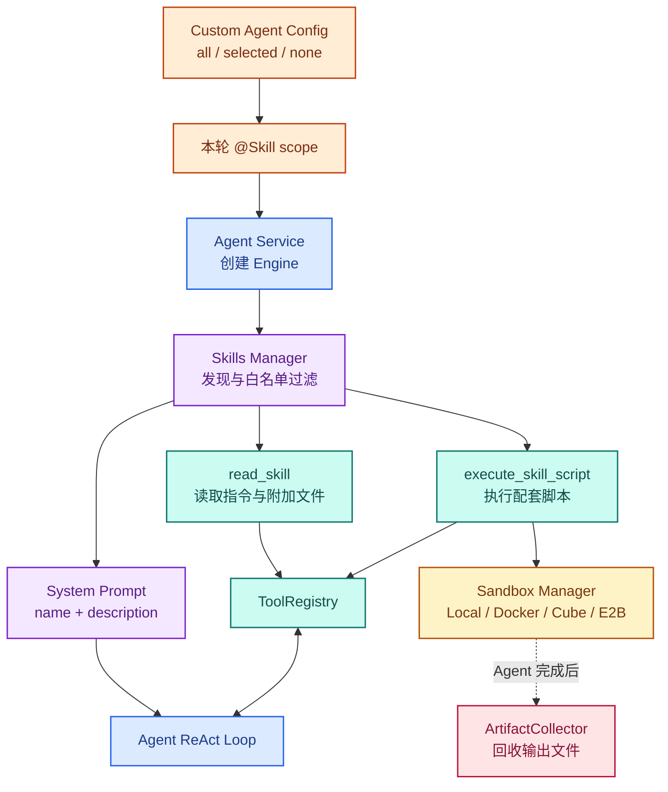
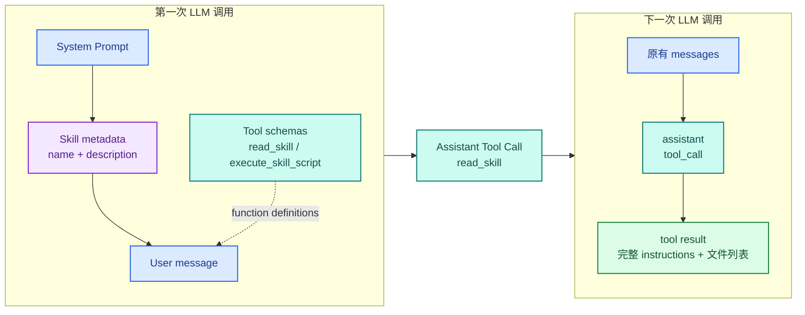
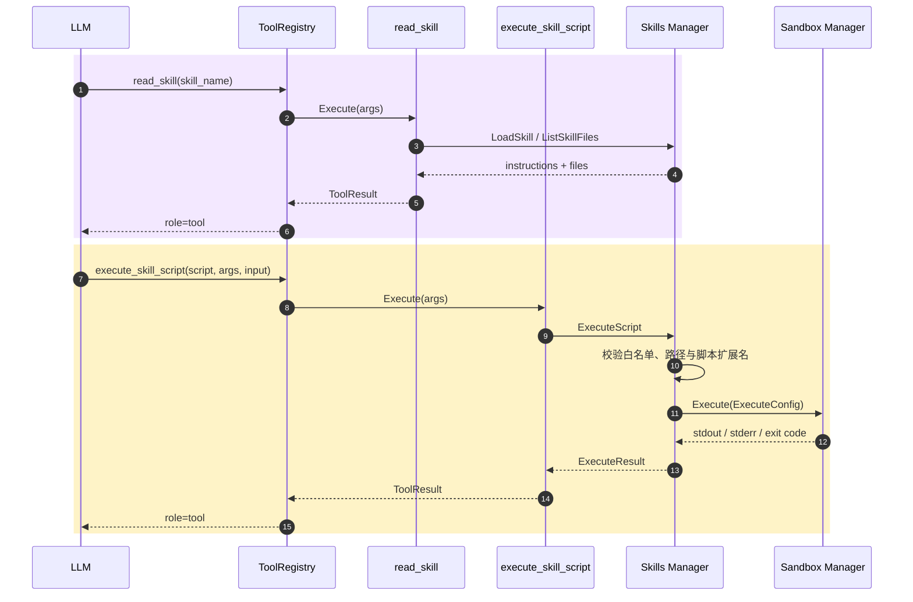
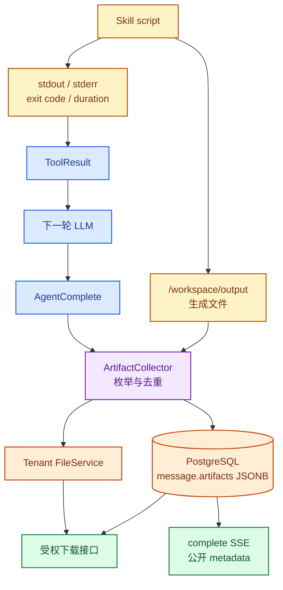

# 拆解 WeKnora Skill：能力如何被发现、加载与执行

上一篇最后留下了两个问题：模型最初只拿到 Skill metadata 时，靠什么决定读取完整 `SKILL.md`；读完以后，脚本又如何进入 Sandbox，并把生成的文件带回会话。

沿着这条链继续追，会发现 Skill 本身没有另起一套执行协议。它给 Agent 增加的是可按需加载的说明和配套脚本，真正的调用仍然经过 ToolRegistry、Agent Loop 和 Sandbox。文本结果立即回到下一轮 LLM，文件产物则要等整个 Agent Run 完成后再单独收集。

这篇从 `skills/preloaded` 开始，依次追踪 `Skill Manager → System Prompt → read_skill → execute_skill_script → ArtifactCollector`。MCP 的连接和授权、Sandbox provider 的内部实现仍然留到后面。

> 本文基于 WeKnora `main` 分支 commit [`4e25684`](https://github.com/Tencent/WeKnora/tree/4e25684b8ff55a70a55c03730d81457c14521d3c)，版本号 `0.7.2`，研究日期为 2026-08-25。

## 1. Skill 在 WeKnora 中是什么

当前版本的 Skill 不是 PostgreSQL 中的一类业务实体，也没有创建、修改和发布 Skill 的 API。它首先是服务端文件系统中的一个目录：

```text
skills/preloaded/data-processor/
├── SKILL.md
└── scripts/
    ├── analyze.py
    ├── extract_info.py
    └── format_converter.py
```

`SKILL.md` 由 YAML frontmatter 和 Markdown 正文组成：

```markdown
---
name: 数据处理器
description: 数据处理与分析技能……
---

# Data Processor

这里开始是完整指令。
```

[`Skill`](https://github.com/Tencent/WeKnora/blob/4e25684b8ff55a70a55c03730d81457c14521d3c/internal/agent/skills/skill.go) 把它拆成三层：name 和 description 是 Level 1 metadata，正文 instructions 是 Level 2，目录中的 scripts、references 等附加文件是 Level 3。

Custom Agent 保存的也不是这份内容，只是三个选择结果：`skills_selection_mode`、`selected_skills` 和 `sandbox_config_id`。前两个决定这个 Agent 能看到哪些预装 Skill，最后一个决定脚本交给哪个 Sandbox backend。

部署时，`docker/Dockerfile.app` 会把预装 Skill 复制进镜像；Compose 又把宿主机的 `./skills/preloaded` 挂载到 `/app/skills/preloaded`。运行路径还可以用 `WEKNORA_SKILLS_DIR` 覆盖。也就是说，当前 Skill 的发布方式本质上仍是部署文件管理，而不是产品内的内容管理。

## 2. Skill 在 Agent 执行链中的位置

Skill 不直接插进 ReAct Loop。Engine 创建时，Application Service 先按 Agent 配置建立 `skills.Manager`，Manager 扫描文件目录，再向现有 ToolRegistry 注册固定工具。



<p class="figure-caption">图 4-1　Skill 在 Agent 配置、Context、Tool 与 Sandbox 之间的位置</p>

这里有三道开关。

第一道在 Custom Agent：`all` 启用全部预装 Skill，`selected` 只启用指定名称，`none` 或空值直接关闭。

第二道是当前请求的 `@Skill`。如果 Agent 原本允许全部 Skill，本轮会缩小到被点名的名称；如果 Agent 使用 selected 模式，只保留点名集合与 Agent 白名单的交集。交集为空时，本轮 Skill 会被关闭。

第三道是 Sandbox 能力。只要 Skill 启用，`read_skill` 就会注册；只有 Sandbox 类型不是 disabled，`execute_skill_script` 才会注册。`list_sandbox_files`、`read_sandbox_file` 和 `shell_exec` 还要继续检查 backend 是否提供 session filesystem 或 remote shell capability。

所以“Agent 能读 Skill”和“Agent 能执行 Skill 脚本”不是同一个开关。

## 3. Skill 如何组织、保存和启用

[`Loader.DiscoverSkills`](https://github.com/Tencent/WeKnora/blob/4e25684b8ff55a70a55c03730d81457c14521d3c/internal/agent/skills/loader.go) 遍历配置目录的一级子目录，只处理其中存在 `SKILL.md` 的目录。文件需要满足几项约束：必须有完整 YAML frontmatter，name 和 description 不能为空，name 最长 64 个字符，description 最长 1024 个字符。

解析失败的目录会被跳过。多个 Skill 目录交给 [`Manager.Initialize`](https://github.com/Tencent/WeKnora/blob/4e25684b8ff55a70a55c03730d81457c14521d3c/internal/agent/skills/manager.go) 后，再按 `AllowedSkills` 做一次名称白名单过滤。

这个 Manager 是每次创建 AgentEngine 时重新构造的，并非整个 Go 进程共享的全局单例。前端调用 `GET /skills` 时走的是另一套 `skillService → Loader`，它只负责列出预装 Skill 的 name 和 description，不与 AgentEngine 共享 cache。

这带来一个容易忽略的事实：页面能列出某个 Skill，不等于当前 Agent 一定能用它。实际执行范围还要经过 Custom Agent 模式、本轮 @mention 和 Engine 创建时的白名单过滤。

显式 `@Skill` 还会产生一段只属于当前 turn 的约束：

```text
<must_use>
Must call read_skill(skill_name="数据处理器")
for @Skill "数据处理器" before answering.
</must_use>
```

它由 [`buildMustUseBlock`](https://github.com/Tencent/WeKnora/blob/4e25684b8ff55a70a55c03730d81457c14521d3c/internal/agent/observe.go) 拼入当前 user message，不写入 PostgreSQL。下一 turn 没有再次 @mention 时，这段约束也不会从历史里回来。

## 4. Agent 如何发现 Skill

Engine 构造 System Prompt 时调用 `GetAllMetadata`，只取得白名单内 Skill 的 name、description 和 BasePath。真正写给模型的是 [`formatSkillsMetadata`](https://github.com/Tencent/WeKnora/blob/4e25684b8ff55a70a55c03730d81457c14521d3c/internal/agent/prompts.go) 生成的一段文本：

```text
Available Skills
1. 数据处理器
   数据处理与分析技能……
2. 文档分析器
   深度分析文档结构和内容……

SCAN → MATCH → LOAD → APPLY
```

这段 Prompt 要求模型先扫描 description，匹配用户意图，命中后调用 `read_skill`，最后按完整指令完成任务。与此同时，LLM 的 function-calling schema 里会出现 `read_skill` 和可能存在的 `execute_skill_script`。

Skill 不会动态产生新的 Tool。无论有 1 个还是 20 个 Skill，注册的仍是那几个固定 FunctionDefinition；变化的是 System Prompt 中的 metadata 列表，以及 `read_skill` 可以接受的名称。

这和 MCP 的接入方式不同。MCP server 暴露的每个远程工具会进入 ToolRegistry，Skill 则是先给固定工具增加可读取的内容目录。一个偏工具扩展，一个偏行为说明与配套资源。

## 5. 渐进披露是如何发生的

从模型视角看，WeKnora 确实分两次披露 Skill。第一次调用只有 metadata；模型调用 `read_skill` 后，完整 instructions 才作为 role=tool 的结果进入 messages。



<p class="figure-caption">图 4-2　Skill metadata 与完整 instructions 分两轮进入模型 Context</p>

但这里要区分 Context 层和文件读取层。

`DiscoverSkills` 的注释说它只读取 frontmatter，实际却调用 `ParseSkillFile`：完整正文会在发现阶段一起解析，`Loaded` 直接设为 true，完整 `Skill` 也被放进 Loader cache。之后的 `read_skill` 通常只是从 cache 取出 instructions，再格式化成 Tool Result。

所以当前实现节省的是模型 Token，而不是第一次扫描时的磁盘读取。真正做到按需读取的是 Level 3：`read_skill` 带 `file_path` 时，Loader 才读取某个 reference 或 script 文件。

还有一个长度边界。`read_skill` 没有自己的分页协议，也没有独立 output budget。ToolRegistry 会使用普通工具的默认 16,000 字符上限，超出后保留头尾并截断中间内容。Skill 指令或 reference 很长时，模型未必能拿到完整正文。

## 6. 一次 Skill 如何被读取并执行

[`read_skill`](https://github.com/Tencent/WeKnora/blob/4e25684b8ff55a70a55c03730d81457c14521d3c/internal/agent/tools/skill_read.go) 返回三部分：description、instructions 和目录文件列表。文件列表会标记哪些扩展名属于可执行脚本；模型需要更多资料时，可以再次调用 `read_skill(skill_name, file_path)`。

如果 Skill 指令要求运行脚本，模型再发起 [`execute_skill_script`](https://github.com/Tencent/WeKnora/blob/4e25684b8ff55a70a55c03730d81457c14521d3c/internal/agent/tools/skill_execute.go)。它接收 Skill 名、脚本相对路径、命令行 args 和 stdin input。



<p class="figure-caption">图 4-3　一次 Skill 读取与脚本执行的时序</p>

[`Manager.ExecuteScript`](https://github.com/Tencent/WeKnora/blob/4e25684b8ff55a70a55c03730d81457c14521d3c/internal/agent/skills/manager.go) 会再次检查 Skill 是否启用、名称是否在白名单、脚本是否存在，以及扩展名是否属于 Python、Shell、JavaScript、Ruby、Perl、PHP 等脚本类型。随后构造 `sandbox.ExecuteConfig`：

```text
Script    = Skill 目录中的绝对脚本路径
WorkDir   = Skill BasePath
Args      = 模型提供的字符串数组
Stdin     = input
SessionID = 当前会话
Env       = 输出目录、历史输出目录、可选输入目录
```

Sandbox Manager 在真正执行前还会静态检查脚本正文、args 和 stdin，拒绝危险命令、网络访问模式、命令替换和常见注入形式。未单独设置时，默认执行 timeout 是 60 秒。

有一个约束只存在于 Prompt，没有对应的服务端状态机。System Prompt 要求模型必须先 `read_skill`，Tool 描述也说只能执行 loaded Skill；但 `execute_skill_script` 并不检查当前 turn 是否已经出现过 `read_skill`。只要 Skill 在白名单中且脚本路径合法，Loader 就能从 discovery cache 找到它并直接执行。

因此，“先读后执行”是 Agent 行为协议，不是执行权限边界。

## 7. Sandbox 如何承接脚本执行

Manager 向不同 Sandbox backend 传递的是同一个 `ExecuteConfig`，实际文件语义却不完全一样。

Local 直接在宿主机启动解释器，工作目录是完整 Skill 目录。Docker 把脚本所在目录整体只读挂载到容器 `/workspace`，每次 `docker run --rm` 后结束。

Cube 和 E2B 走 [`SessionBoundManager`](https://github.com/Tencent/WeKnora/blob/4e25684b8ff55a70a55c03730d81457c14521d3c/internal/sandbox/session_manager.go)。它按 tenant + session 解析一个远程 Sandbox，绑定信息保存在 Redis，创建和恢复由分布式 lifecycle lock 串行化。同一 session 的多次 `execute_skill_script` 和 `shell_exec` 可以复用远程实例中的文件与已安装依赖。

远程执行时，[`RemoteSandbox.ExecuteOnHandle`](https://github.com/Tencent/WeKnora/blob/4e25684b8ff55a70a55c03730d81457c14521d3c/internal/sandbox/remote_sandbox.go) 只读取本次脚本内容，把它上传为 `/workspace/<script basename>`，工作目录也固定为 `/workspace`。它不会自动把 Skill 的整个目录、references 和其他脚本一起复制过去。

用户上传的附件走独立路径。AgentQA 会在模型调用前，从持久化 FileService 恢复本 session 的附件到：

```text
/workspace/input/<storage-url-hash>/<safe-file-name>
```

这些绝对路径以 `<sandbox_attachments>` 附加到当前 user message。模型可以把它们作为脚本 args；脚本则通过 `WEKNORA_SESSION_INPUT_DIR` 知道输入根目录。

远程 Sandbox 不会在一次 Agent Run 结束时销毁。provider 的 TTL 负责空闲回收；用户删除 WeKnora session 时，Application Service 才显式调用 `DestroySession`。这也是后续 turn 能继续看到之前文件的基础。

## 8. 执行结果和产物如何返回

Skill 脚本有两类输出，它们走的不是同一条链。

stdout、stderr、exit code、duration 和 killed 状态直接组成 `ToolResult`。ToolRegistry 先应用输出长度上限，AgentEngine 再发出 tool-result 事件、写入 AgentStep，并把它作为 role=tool 消息追加到当前 messages。下一轮 LLM 能立即读取这些文本。

文件不会塞进 Tool Result。脚本必须把它写入 `WEKNORA_SKILL_OUTPUT_DIR`，默认是 `/workspace/output`。Agent 结束时，Handler 才调用 [`ArtifactCollector.Collect`](https://github.com/Tencent/WeKnora/blob/4e25684b8ff55a70a55c03730d81457c14521d3c/internal/application/service/artifact_collector.go)。



<p class="figure-caption">图 4-4　文本结果与文件产物从 Skill 脚本返回用户的两条路径</p>

Collector 递归扫描输出目录，用 `(SourcePath, ModTime)` 与本 session 已记录的文件比较，只处理新增或修改过的文件。单文件上限是 50 MiB。读取或上传某个文件失败时只跳过该文件，不让最终回答失败。

成功的文件会写入租户现有 FileService，并以 `MessageArtifact` 形式保存到 assistant message 的 JSONB 字段。Sandbox 中的源文件不会删除，后续 Skill 仍可继续使用。

complete SSE 只把文件名、大小、Sandbox 源路径、时间和数组 index 发给前端，不发送服务端 storage URL。下载时，客户端用 session ID、message ID 和 index 请求专门接口；Handler 重新验证 session 归属，再从 FileService 读取文件，并强制以 attachment 方式返回。

这一步把可下载文件从 Sandbox 生命周期中剥离了出来。远程实例被 provider 回收以后，用户仍能从会话消息下载已经持久化的产物。

## 9. Skill、Tool 与 MCP 的边界

Skill 解决“完成一类任务时应该遵循什么方法，以及有哪些配套资源”。它首先是 Prompt 内容，也可以带确定性的脚本。

Tool 解决“模型现在可以调用什么函数”。`read_skill`、`execute_skill_script` 本身都是普通 Tool，它们经过同一个参数校验、执行、事件、AgentSteps 和 Context 回填链路。

MCP 解决“外部服务如何把工具暴露给 Agent”。每个 MCP Tool 会注册成独立 FunctionDefinition；Skill 不会因为目录中多了一个脚本就自动生成同名 FunctionDefinition。

Sandbox 解决“脚本在哪里运行，以及会话文件如何隔离和保留”。它不知道 Skill 的 instructions，也不决定模型是否应该使用某个 Skill；它只接收已经解析好的 `ExecuteConfig`。

四者连起来以后，实际关系是：Skill 指导模型选择 Tool，Tool 把脚本交给 Sandbox；Skill 也可以在 instructions 中要求模型调用知识库 Tool 或 MCP Tool，但这种关系仍是文本协议，不是 Skill Manager 动态编排出一张工作流。

## 10. 几个值得继续追的设计选择

### 渐进披露优化的是 Context，不是首次扫描

System Prompt 只携带 name 和 description，Skill 数量增加时仍然会线性增长，但不会一开始就塞入每份完整说明。当前 Loader 会提前读取完整 `SKILL.md`，所以它没有同时优化文件 I/O。

我认为这个取舍对当前 5 个预装 Skill 没什么问题。以后如果变成几百个租户 Skill，metadata 的检索方式和 Loader cache 的粒度都可能需要调整。

### 固定 Tool 保持了 Agent Loop 的简单性

Skill 没有另造执行器。读取 instructions 和执行脚本都复用既有 ToolRegistry，因此第二篇分析过的参数校验、并行执行、事件流和持久化逻辑不需要再实现一遍。

代价是部分重要顺序只能靠 Prompt 维持。“先 read 后 execute”没有服务端状态，不能作为权限或安全保证。

### Artifact 不进入 LLM Context

二进制文件放进 Context 没有意义。WeKnora 只把 stdout / stderr 交给下一轮模型，文件在 AgentComplete 阶段另行复制到 FileService。这条边界让模型输入和用户下载使用不同的数据通道。

问题也随之出现：Collector 发生在 Loop 结束后，本轮 LLM 不会自动收到最终 artifact 清单。模型能否准确告诉用户生成了什么，依赖 Skill 指令、脚本 stdout，或者结束前主动调用 Sandbox 文件工具。

### Sandbox 能力决定产品能力

`execute_skill_script` 在 Docker、Local、Cube、E2B 上都可能注册，但 session attachment staging、跨调用文件状态、文件枚举和 artifact collection 只在具备对应 capability 的远程 backend 上成立。

从产品语义看，“能运行脚本”与“能处理会话附件并返回下载文件”应该被当作两档能力，而不是一个布尔开关。

## 11. 暂时没有搞清楚的问题

- 当前只有预装 filesystem Skill。租户自定义 Skill、版本、审核与发布是否会加入，当前 commit 没有实现证据。
- `read_skill` 使用通用 16k Tool 输出上限，没有 Skill 专用的分页或分段读取。长指令被截断后，模型如何确认遗漏了哪些步骤，还没有协议。
- RemoteSandbox 只上传本次脚本，不复制 Skill 的同级资源。依赖本地 reference 或数据文件的脚本怎样跨 backend 工作，目前没有统一约定。
- Docker 把 Skill 目录只读挂载到 `/workspace`，Local 也没有 session artifact source，但 Prompt 仍要求写 `/workspace/output`。这两个 backend 是否只定位为 stdout-only fallback，配置层没有明确说明。
- AgentComplete 后才收集 artifact。如果 Agent 运行异常退出，没有发出完成事件，Sandbox 中已经生成的文件是否会在后续 turn 被补收集，需要运行验证。

## 12. 总结

WeKnora 的 Skill 是一层放在 Agent 与 Tool 之间的能力说明。服务端从预装目录发现 Skill，把 name 和 description 加进 System Prompt；模型判断命中后，用 `read_skill` 把完整 instructions 拉进当前 Context。Skill 带脚本时，再通过 `execute_skill_script` 进入已有 Sandbox。

这条链没有绕开 Agent Loop。Skill 读取和脚本执行仍是普通 Tool Call，stdout / stderr 仍通过 Tool Result 回到下一轮模型。真正不同的是文件产物：它们留在远程 session sandbox 的 `/workspace/output`，等 AgentComplete 后才被收集、持久化到 assistant message，并通过受权接口供用户下载。

把这几个边界拆开后，Skill 就不再是一个抽象的“能力包”：metadata 负责发现，instructions 负责约束，Tool 负责调用，Sandbox 负责执行，ArtifactCollector 负责把文件带出运行环境。

下一篇先把 Sandbox 解释清楚：它要隔离什么，常见开源方案把边界放在哪里。然后再回到 WeKnora，看它为什么需要 Sandbox、怎样配置 Local、Docker、Cube 和 E2B，以及四种 backend 分别适合什么场景。
