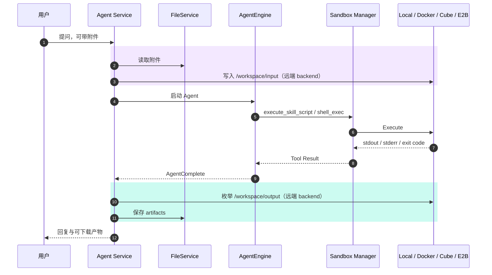
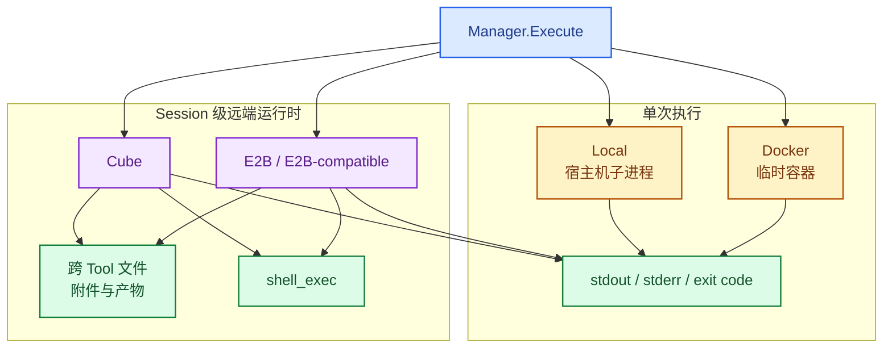
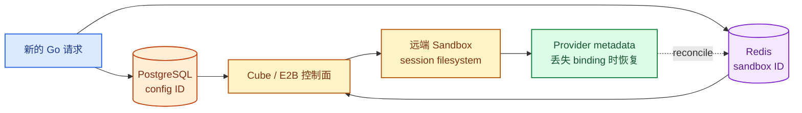

# 拆解 WeKnora Sandbox：Agent 的脚本是如何执行的

上一篇追到 `execute_skill_script` 时，脚本已经离开 Tool 层，进入 `Sandbox Manager.Execute`。继续追代码之前，需要先把 Sandbox 本身讲清楚，再解释 Agent 为什么需要它。

这篇先介绍 Sandbox 的定义、发展和常见方案，然后回到 WeKnora：它用 Sandbox 做什么，如何配置，以及 Local、Docker、Cube 和 E2B 分别适合什么场景。

> 本文基于 WeKnora `main` 分支 commit [`4e25684`](https://github.com/Tencent/WeKnora/tree/4e25684b8ff55a70a55c03730d81457c14521d3c)，版本号 `0.7.2`，研究日期为 2026-08-26。

## 1. Sandbox 是什么

Sandbox 是一种隔离正在运行的程序、限制故障与漏洞影响范围的安全机制。

它允许一段不被完全信任的程序运行，但只向程序开放受控的文件、内存、网络、系统调用和计算资源。程序即使出错或试图越权，影响也应被限制在 Sandbox 边界内。

Sandbox 不是容器、虚拟机或者某个具体产品。它是一种安全边界，宿主机进程、容器、用户态内核、受限运行时和 MicroVM 都可以用来实现这条边界。评价一个 Sandbox，至少要看六件事：

- 代码能看到哪些文件；
- 能否访问网络，能访问哪里；
- 能调用多少宿主内核接口；
- 使用什么用户和权限；
- CPU、内存、进程数和执行时间由谁限制；
- 执行结束后，进程与文件是否继续存在。

所以“用了容器”不等于问题已经解决，“跑在云上”也不自动代表隔离更强。底层实现决定了边界在哪里，也决定了启动速度、兼容性和运行成本。

### Sandbox 是怎么发展到今天的

早期 Sandbox 主要依赖操作系统提供的用户权限、进程隔离、文件权限和系统调用限制。

容器把 namespace、cgroup、capability、seccomp 和文件挂载组合起来，用较低成本隔离文件系统、网络、进程和资源。容器运行效率较高，但不同容器仍然共享宿主机内核。

云计算和 Serverless 需要高密度运行来自不同租户的任务。Sandbox 开始同时追求更强的隔离、更快的启动速度和更低的资源开销，用户态内核和 MicroVM 因此得到发展。

现在的远端 Sandbox 又增加了控制面。它不只运行代码，还负责实例创建、文件传输、命令执行、暂停恢复和生命周期管理。

```mermaid
flowchart LR
    process["宿主机子进程<br/>共享宿主内核与文件系统"]
    container["Linux 容器<br/>namespace / cgroup / capability"]
    kernel["用户态内核 / 受限运行时<br/>拦截 syscall 或收窄 API"]
    microvm["MicroVM<br/>硬件虚拟化边界"]
    platform["托管 Sandbox 平台<br/>控制面 + runtime + 文件 API"]

    process --> container --> kernel --> microvm --> platform

    classDef weak fill:#fef3c7,stroke:#b45309,color:#78350f,stroke-width:1.5px;
    classDef containerNode fill:#ccfbf1,stroke:#0f766e,color:#134e4a,stroke-width:1.5px;
    classDef runtimeNode fill:#dbeafe,stroke:#2563eb,color:#1e3a8a,stroke-width:1.5px;
    classDef vmNode fill:#f3e8ff,stroke:#7e22ce,color:#581c87,stroke-width:1.5px;
    classDef platformNode fill:#ffe4e6,stroke:#be123c,color:#881337,stroke-width:1.5px;

    class process weak;
    class container containerNode;
    class kernel runtimeNode;
    class microvm vmNode;
    class platform platformNode;
```



<p class="figure-caption">图 5-1　常见 Sandbox 把隔离边界放在不同位置；越往右不一定越适合，启动成本、兼容性和运维方式也会变化</p>

### 常见 Sandbox 方案

**宿主机子进程**直接在宿主机启动受限进程，通过用户权限、工作目录、环境变量和 timeout 控制执行。实现简单、启动快，但隔离能力有限，适合开发环境或受信脚本。

**Linux 容器**使用 namespace、cgroup、capability、seccomp 和文件挂载限制进程。它兼容普通 Linux 工具链，适合一次性脚本和构建任务，但仍然共享宿主机内核。

**Google [gVisor](https://github.com/google/gvisor)** 在应用和宿主内核之间增加用户态 application kernel，拦截并重新实现大量 Linux 系统接口。它保留容器使用方式，同时减少程序直接接触的宿主内核攻击面。

**[Firecracker](https://github.com/firecracker-microvm/firecracker) 与 [Kata Containers](https://github.com/kata-containers/kata-containers)** 使用轻量虚拟机加强 workload 隔离。Firecracker 提供基于 KVM 的 MicroVM，Kata 则把轻量 VM 包装成 OCI/containerd 可以使用的容器 runtime。

**Microsoft [Hyperlight](https://github.com/hyperlight-dev/hyperlight-sandbox)** 在很小的 MicroVM 中执行函数或受限 runtime，不启动完整 Guest OS，更适合短时间、高密度的函数执行。

**[Cloudflare Containers](https://developers.cloudflare.com/containers/) 与 [Sandbox SDK](https://developers.cloudflare.com/sandbox/)** 把托管容器、Worker 和 Durable Object 组合起来，向上提供命令执行、文件管理、后台进程和生命周期 API。[SDK 源码](https://github.com/cloudflare/sandbox-sdk)以 Apache 2.0 发布，实际计算运行在 Cloudflare 托管的 Containers 上。

**E2B、CubeSandbox 等远端 Sandbox 平台**在隔离 runtime 之外增加控制面、模板、文件 API 和实例生命周期。它们更接近上层系统可以直接使用的远端工作空间，底层可以采用容器、MicroVM 或其他隔离技术。

这些方案没有统一的优劣顺序。选择时要同时考虑隔离强度、启动成本、Linux 兼容性、文件是否需要保留，以及是否愿意自己维护控制面。

## 2. Agent 为什么需要 Sandbox

Agent 不只生成文本。在完成数据分析、文件处理、代码生成和自动化任务时，它可能需要执行 Shell 命令、Python 脚本或第三方程序。

这些命令和参数可能由模型根据当前任务动态生成，无法在开发阶段完全确定。如果直接在 Agent 服务所在的机器上执行，错误命令、死循环、依赖漏洞和越权访问都可能影响主服务。

Sandbox 位于 Tool 和实际执行环境之间，负责限制脚本可以使用的文件、网络、权限和计算资源：

```text
Agent 决定执行什么
        ↓
Tool 提交命令或脚本
        ↓
Sandbox 限制执行边界
        ↓
Process / Container / MicroVM 执行
```

传统 Sandbox 只要隔离一次程序执行可能就够了。Agent 还需要在多次 Tool Call 之间保留文件，接收用户附件，安装依赖，并把生成的文件返回给用户。这些需求推动 Sandbox 从一次性代码执行器向有文件系统、有身份和有生命周期的远端工作空间发展。

Agent 没有发明 Sandbox。Agent 对动态命令执行和连续工作空间的需求，加速了 Agent Sandbox 产品和基础设施的发展。

## 3. Sandbox 在 WeKnora 执行链中的位置

WeKnora 的 Sandbox 不参与文档解析，也不是 RAG 检索服务。它解决的是 Agent 获得 Skill 以后，脚本究竟在哪里执行，以及执行产生的文件如何进出这个环境。

当前有两个命令入口。

第一个是 [`execute_skill_script`](https://github.com/Tencent/WeKnora/blob/4e25684b8ff55a70a55c03730d81457c14521d3c/internal/agent/tools/skill_execute.go)。模型不能把一段临时生成的代码直接塞进这个 Tool；Tool 先从已经加载的 Skill 中找到服务端脚本，再传入 args、stdin 和环境变量。数据分析、格式转换或者生成文件的 Skill 都走这条路径。

第二个是 [`shell_exec`](https://github.com/Tencent/WeKnora/blob/4e25684b8ff55a70a55c03730d81457c14521d3c/internal/agent/tools/shell_exec.go)。它允许模型在当前远端 session 中执行临时 Shell 命令，例如检查目录、安装依赖或者继续处理上一个 Tool 留下的文件。这个 Tool 只在 backend 提供 `SessionShellExecutor` 能力时注册，Local 和 Docker 没有它。

Sandbox 还承担两条文件通道：

- AgentEngine 启动前，用户附件从 FileService 写入远端 Sandbox 的 `/workspace/input`；
- AgentComplete 之后，`/workspace/output` 中的文件被复制回 FileService，并保存到 assistant message 的 `artifacts` 字段。



<p class="figure-caption">图 5-2　WeKnora 用 Sandbox 承接 Skill 脚本和远端 Shell，附件与产物走独立的文件通道</p>

这也解释了为什么 Sandbox 不是 Compose 里必然常驻的第五个业务进程。Local 是 `app` 启动的子进程；Docker 是按调用执行 `docker run --rm`；Cube 和 E2B 才是由外部控制面创建的远端 runtime。Compose 中名为 `sandbox` 的 service 只用于构建或拉取标准镜像，`command: ["true"]` 执行后就退出。

## 4. WeKnora 如何配置 Sandbox

Sandbox 配置分成 Workspace 和 Agent 两层。实际操作有三步：打开 Workspace 的 Sandbox 设置，添加并验证 Backend，再让 Agent 选择这份配置。

### 第一步：在 Workspace 中打开 Sandbox

进入“设置 → 沙箱后端”。页面顶部的开关控制整个 Workspace 是否允许执行 Skill 脚本；下面的配置列表用来管理 Local、Docker、Cube 和 E2B。关闭总开关后，本空间所有 Agent 仍然可以读取 Skill 内容，但不会执行其中的脚本。


<p class="figure-caption">图 5-3　Workspace 的 Sandbox 总开关和命名配置入口</p>

### 第二步：添加并验证 Backend

点击“添加沙箱后端”，先选择类型并填写配置名称。四种类型需要的字段不同：

- Local 没有 provider 参数。脚本直接由 Go 服务所在主机的解释器运行，页面因此给出风险提示。
- Docker 需要镜像名，官方表单推荐 `wechatopenai/weknora-sandbox:latest`。生产环境更适合使用与 WeKnora 版本对应的固定 tag。执行机器还必须能调用 Docker daemon。
- Cube 需要 API URL、Proxy URL、sandbox domain 和 template，API key 可选。私网部署需要显式打开“允许访问私网集群地址”。
- E2B Cloud 至少需要 API key 和 template；自建 E2B 或兼容控制面还可以填写 API URL、sandbox domain 与 Proxy URL。

Cube 与 E2B 的详细集群准备、标准镜像和模板要求已经写在 WeKnora 的 [`docs/sandbox-cluster.md`](https://github.com/Tencent/WeKnora/blob/4e25684b8ff55a70a55c03730d81457c14521d3c/docs/sandbox-cluster.md)。其中标准镜像提供 Python 3.11、Node.js 20、基础 Shell 工具、`/workspace` 和 UID 1000 的非 root 用户。


<p class="figure-caption">图 5-4　添加 CubeSandbox 时先填写控制面、Proxy 和 Sandbox 域名</p>

Cube 和 E2B 采用三步向导。第一步验证控制面连接；连接通过后，第二步从 provider 加载并选择模板；第三步设置 HTTP timeout、Sandbox TTL、默认执行 timeout 和环境变量。保存前还可以执行完整验证：创建一个临时 Sandbox，运行脚本，检查出网，再销毁实例。

Local 与 Docker 没有控制面和模板步骤，只设置运行参数。环境变量会暴露给该配置创建的所有脚本，不适合放入脚本本身不应该读取的秘密。

API key 和环境变量值保存在 `tenant_sandbox_configs` 的加密 JSONB 中，对外查询只返回占位符。配置解析失败时不会偷偷降级到 Local：[`resolveTenantSandboxForConfig`](https://github.com/Tencent/WeKnora/blob/4e25684b8ff55a70a55c03730d81457c14521d3c/internal/application/service/tenant_sandbox_resolve.go) 直接返回错误。这个行为避免远端隔离不可用时，把脚本意外放到 Go 服务宿主机运行。

### 第三步：让 Agent 选择这份配置

打开 Agent 编辑页，在“能力扩展 → 沙箱后端”中选择刚保存的命名 Backend。这里选择的是 Workspace 已经验证过的配置；Agent 自己不再保存 API URL、API key 和 template。


<p class="figure-caption">图 5-5　Agent 只选择 Workspace 中已有的命名配置</p>

最终写入 Agent 配置的是 `sandbox_config_id`，不是整套 provider credentials。

### 配置如何进入运行时

```mermaid
flowchart LR
    settings["Workspace 设置<br/>脚本总开关"]
    named["命名 Sandbox 配置<br/>Local / Docker / Cube / E2B"]
    check["连接检查<br/>模板与运行参数"]
    agent["Agent 配置<br/>sandbox_config_id"]
    session["首次远端执行<br/>session 固定配置"]

    settings --> named --> check --> agent --> session

    classDef policy fill:#ffe4e6,stroke:#be123c,color:#881337,stroke-width:1.5px;
    classDef config fill:#dbeafe,stroke:#2563eb,color:#1e3a8a,stroke-width:1.5px;
    classDef verify fill:#ccfbf1,stroke:#0f766e,color:#134e4a,stroke-width:1.5px;
    classDef agentNode fill:#fef3c7,stroke:#b45309,color:#78350f,stroke-width:1.5px;
    classDef sessionNode fill:#f3e8ff,stroke:#7e22ce,color:#581c87,stroke-width:1.5px;

    class settings policy;
    class named config;
    class check verify;
    class agent agentNode;
    class session sessionNode;
```



<p class="figure-caption">图 5-6　Sandbox 先在 Workspace 中建立并验证，再由 Agent 通过配置 ID 选择</p>

AgentEngine 创建前，[`resolveSandboxForExecution`](https://github.com/Tencent/WeKnora/blob/4e25684b8ff55a70a55c03730d81457c14521d3c/internal/application/service/session_sandbox_pin.go) 根据 Workspace policy 和配置 ID 解析 Manager。Local、Docker 得到 `DefaultManager`，Cube、E2B 得到 `SessionBoundManager`；Agent 没有选择配置时得到 DisabledManager。

命名配置不存在、无法解密或 provider 参数无效时，resolver 直接返回错误，不会自动改用 Local。更换 backend 不只是可用性降级，也可能改变脚本所在的安全边界。

## 5. 一次 Skill 脚本如何进入 Sandbox

模型调用 `execute_skill_script` 后，真正的执行链是：

```text
ExecuteSkillScriptTool.Execute
  ↓
skills.Manager.ExecuteScript
  ↓
构造 ExecuteConfig
  ↓
DefaultManager / SessionBoundManager.Execute
  ↓
ScriptValidator
  ↓
Local / Docker / RemoteSandbox
  ↓
ExecuteResult
  ↓
Tool Result
```

[`ExecuteSkillScriptTool.Execute`](https://github.com/Tencent/WeKnora/blob/4e25684b8ff55a70a55c03730d81457c14521d3c/internal/agent/tools/skill_execute.go) 先解析 `skill_name`、`script_path`、args 和 input，再调用 Skill Manager。它自己不读取文件，也不启动解释器。

[`skills.Manager.ExecuteScript`](https://github.com/Tencent/WeKnora/blob/4e25684b8ff55a70a55c03730d81457c14521d3c/internal/agent/skills/manager.go) 检查 Skill 是否允许、目标文件是否存在以及它是否被识别为脚本。随后构造 `ExecuteConfig`：`Script` 指向脚本绝对路径，`WorkDir` 是 Skill 根目录，args 和 stdin 保持原值，session ID 从 context 读取，环境变量中加入输入与产物目录。

四种 backend 对上层暴露同一个 [`Manager.Execute`](https://github.com/Tencent/WeKnora/blob/4e25684b8ff55a70a55c03730d81457c14521d3c/internal/sandbox/sandbox.go)。输入包含脚本、参数、stdin、环境变量、session ID、timeout 和资源限制；输出包含 stdout、stderr、exit code、耗时和是否因 timeout 被结束。

真正执行前，[`ScriptValidator`](https://github.com/Tencent/WeKnora/blob/4e25684b8ff55a70a55c03730d81457c14521d3c/internal/sandbox/validator.go) 会检查脚本正文、args 和 stdin，拒绝危险命令、常见网络访问、reverse shell、Shell operator 与 command substitution。这是一道前置护栏，不替代 backend 自己的隔离。

到了 backend 以后，脚本的文件语义开始分叉：Local 直接使用宿主机上的绝对路径；Docker 把脚本目录只读挂载到 `/workspace`；远端 [`RemoteSandbox.ExecuteOnHandle`](https://github.com/Tencent/WeKnora/blob/4e25684b8ff55a70a55c03730d81457c14521d3c/internal/sandbox/remote_sandbox.go) 读取脚本内容，只上传为 `/workspace/<basename>`，再由 provider 启动解释器。

执行结果回到 Tool 后，`ExitCode`、`Duration`、stdout、stderr 和 killed 状态被整理成文本 Tool Result，进入下一轮 LLM。二进制文件不会塞进 Tool Result，而是写入 `/workspace/output`，等 Agent 完成后再收集。

## 6. 四种 Backend 的执行语义有什么不同

四种 backend 共享 `Execute` 入口，不能因此认为它们可以无损互换。最直接的差异是：Local 和 Docker 以单次执行为中心；Cube 与 E2B 以 session 工作区为中心。



<p class="figure-caption">图 5-7　Local 与 Docker 返回单次执行结果，Cube 与 E2B 还提供 session 文件系统和远端 Shell</p>

### Local：开发与受信环境

[`LocalSandbox`](https://github.com/Tencent/WeKnora/blob/4e25684b8ff55a70a55c03730d81457c14521d3c/internal/sandbox/local.go) 直接调用 Go 服务所在主机的 Python、Bash、Node 等解释器。它要求绝对脚本路径，检查允许目录和解释器，构造最小环境，并用 context timeout 结束进程组。

Local 的优点是启动最快，也不需要 Docker 或外部控制面。适合开发机、单人测试，或者明确受信的内置脚本。它没有独立文件系统和 kernel 边界，不能因为类型名里有 Sandbox 就把它当成生产级不可信代码隔离。

### Docker：无状态的单次 Skill 脚本

[`DockerSandbox`](https://github.com/Tencent/WeKnora/blob/4e25684b8ff55a70a55c03730d81457c14521d3c/internal/sandbox/docker.go) 每次执行 `docker run --rm`。容器使用 UID/GID 1000，drop all capabilities，设置 `no-new-privileges`、PID、CPU 和内存限制，默认关闭网络；脚本所在目录只读挂载到 `/workspace`。调用结束后容器删除。

它适合输入来自参数或 stdin、结果主要通过 stdout 返回的 Skill。例如文本转换、一次性计算或不需要保存中间文件的脚本。它比 Local 多了一层容器边界，但仍与宿主机共享 kernel；同时没有 session 文件系统，因此用户附件不会通过 `/workspace/input` 接入，脚本生成的文件也不会由 ArtifactCollector 带回。

Compose 里的 `sandbox` service 不会常驻等待任务。`full` profile 只负责把标准镜像 build/pull 到本机，真正执行时仍由 `app` 按需调用 Docker CLI 创建临时容器。

### Cube：自建的 session 工作区

Cube 通过 WeKnora 的原生 Cube client 接入外部 CubeSandbox 集群。第一次有 SessionID 的执行会创建远端实例，后续 `execute_skill_script`、`shell_exec`、附件 staging 和 artifact collection 都可以重新连接同一个实例。

它适合希望自建控制面、数据不离开自有环境，并且 Agent 需要跨多次 Tool Call 保存文件或安装依赖的场景。代价是部署者要负责计算节点、模板、Proxy、域名、Redis 绑定、容量与孤儿资源清理。没有 SessionID 的调用不会持久化，仍然走 create → execute → delete。

### E2B：托管或兼容控制面的 session 工作区

E2B backend 使用 E2B 协议，可以连接 E2B Cloud、自建 E2B Infrastructure，或其他兼容实现。它和 Cube 一样提供 session 级文件、Shell、附件和产物能力；配置还支持 E2B volume，用于跨 Sandbox 共享租户安装的 Skill 或其他数据。

它适合希望直接使用托管代码执行平台，或者已有 E2B-compatible 基础设施的团队。E2B Cloud 减少集群运维，自建或兼容控制面则仍要处理 API、gateway、domain、template 和网络可达性。

如果只看“能不能运行脚本”，四种 backend 都可以。如果脚本必须读取用户附件、在多轮 Tool Call 之间保留文件、执行临时 Shell，并把生成文件返回用户，当前只有 Cube 和 E2B 提供完整链路。

## 7. 远端 Sandbox 如何维持 Session 工作区

一个 session 第一次创建远端实例后，会把当时使用的 config ID 写入 `sessions.sandbox_config_id`。管理员随后修改 Agent 的选择，旧 session 仍然去原配置下找已有实例；实例销毁并清掉 pin 后，下一次创建才采用新选择。这个字段保存的是已有资源的归属，不是用户偏好。

Cube 和 E2B 都走 [`SessionBoundManager`](https://github.com/Tencent/WeKnora/blob/4e25684b8ff55a70a55c03730d81457c14521d3c/internal/sandbox/session_manager.go)。Manager 每次请求都可以重新构造，远端实例仍能找回来，因为状态不在 Go 对象里：

- PostgreSQL `sessions.sandbox_config_id` 记录实例属于哪个命名配置；
- Redis binding 记录 `tenant + session → provider + sandbox ID`；
- provider metadata 写入 tenant、session、provider 和 config ID，在 Redis binding 丢失时用于反向恢复。



<p class="figure-caption">图 5-8　远端实例的权威状态分散在 PostgreSQL、Redis 和 provider，不依赖常驻的 Go Manager</p>

第一次创建时，PostgreSQL config pin 和 Redis lifecycle lock 会分别解决“用哪个配置”和“创建哪个实例”的并发竞争。Redis binding 没有 TTL；Cube 和 E2B 的 provider TTL 到期后以 pause 为目标，下一次连接再恢复。这里持久的是运行环境和文件系统，不是执行到一半的 Tool Call。Go 进程崩溃后，WeKnora 没有从命令中间 checkpoint 继续执行的证据。

远端工作区还承担附件和产物的双向传输。AgentEngine 启动前，[`stageSessionAttachments`](https://github.com/Tencent/WeKnora/blob/4e25684b8ff55a70a55c03730d81457c14521d3c/internal/application/service/session_attachment_staging.go) 从 FileService 读取附件，写入 `/workspace/input`。这个步骤可以触发远端实例的首次创建。

AgentComplete 后，[`ArtifactCollector`](https://github.com/Tencent/WeKnora/blob/4e25684b8ff55a70a55c03730d81457c14521d3c/internal/application/service/artifact_collector.go) 枚举 `/workspace/output`，把新文件复制回 FileService，并将 metadata 写入 assistant message。Collector 只连接已有实例，不会为了扫描空目录再创建一个 Sandbox。

因此 `/workspace` 保存的是 session 执行中的工作状态。文件只有进入 FileService，才能在 provider 回收远端实例以后继续下载。

用户删除 session 时，Application Service 会先用旧 config 找到远端实例，调用 provider Delete，再清掉 Redis binding 和 PostgreSQL pin。清理是 best effort：provider 不可用不会阻止业务 session 删除。源码虽然实现了 `ReapOrphanSandboxes`，但在当前 commit 没有找到生产调度入口；因此不能写成孤儿实例一定会被后台周期回收。

## 8. 几个实现取舍

### 统一的是 Execute 接口，不是 Backend 能力

`Manager.Execute` 让 Skill Tool 不需要理解 provider，但 Local、Docker、Cube 和 E2B 并不能透明替换。Session 文件、Shell、附件和产物都通过 capability 接口单独暴露。

### 配置解析选择 Fail Closed

远端配置无效时直接失败，不自动降级到 Local。我认为这是必要的：一个 backend 不可用，不应悄悄改变脚本运行的安全边界。

### Manager 无状态，Session 状态外置

Manager 可以按请求重建，Go 服务也可以横向扩容；代价是一次远端执行需要同时处理 PostgreSQL、Redis 和 provider 三层状态。

### Artifact 与 Sandbox 生命周期分离

Sandbox 文件系统服务于执行中的 session，FileService 服务于用户可以长期访问的结果。远端实例被回收以后，已经持久化的 artifact 仍然可以下载。

## 9. 暂时没有搞清楚的问题

- `ReapOrphanSandboxes` 已有实现和测试，但当前 commit 没有发现生产调度入口。
- Session teardown 失败后，没有发现写入队列或数据库的 durable retry。
- Cube 与 E2B 都支持 pause 和 reconnect，但文件保留、恢复耗时和计费是否一致，不能只凭 adapter interface 判断。
- 远端 Sandbox 的出网策略与 ScriptValidator 的网络规则如何配合，还需要结合真实 Skill 运行验证。
- Local 和 Docker 可以执行 Skill，却没有 session 文件、附件、artifact 和 Shell 能力；产品界面是否完整表达了这组差异，还需要交互检查。

## 10. 总结

Sandbox 是 Agent 与实际执行环境之间的安全边界。WeKnora 没有把它做成 AgentEngine 内部的一种特殊状态，而是让 Tool 通过统一 Manager 调用 Local、Docker、Cube 或 E2B。

统一的是执行入口，四种 backend 的进程和会话语义并不相同。Local 启动宿主机子进程，Docker 创建一次性容器，Cube 和 E2B 则提供可以跨 Tool Call 复用的远端工作区。

远端工作区能够跨请求恢复，依靠 PostgreSQL 保存配置归属、Redis 保存实例绑定、provider metadata 提供反向恢复。附件和产物再通过 FileService 跨越 Sandbox 生命周期。

下一篇可以继续看 MCP：远端 Tool 如何进入 ToolRegistry，连接、OAuth 和 Tool approval 又分别在哪一层生效。
