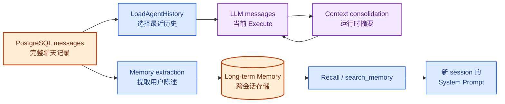
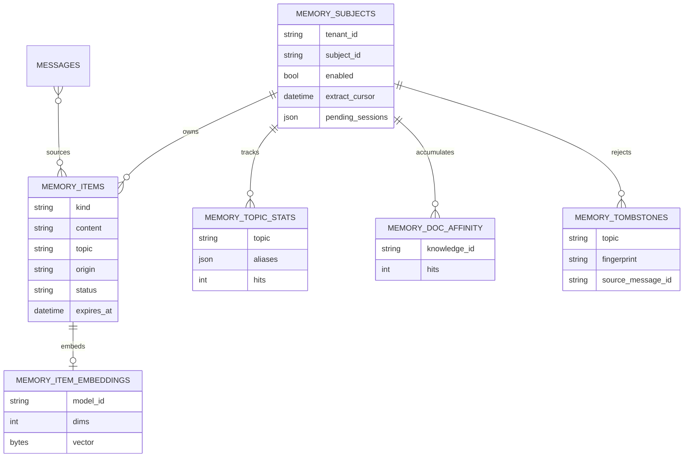
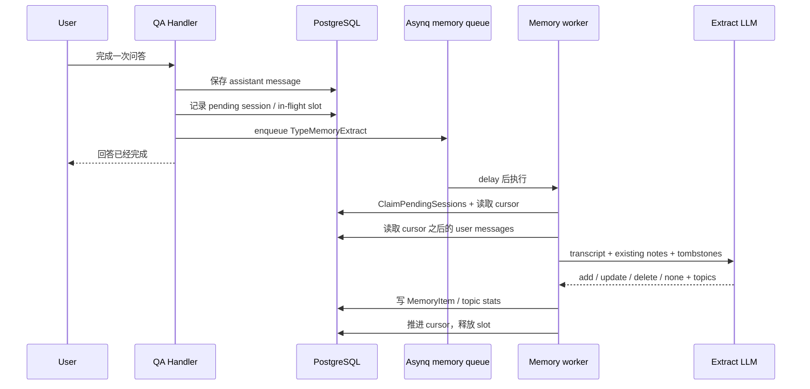
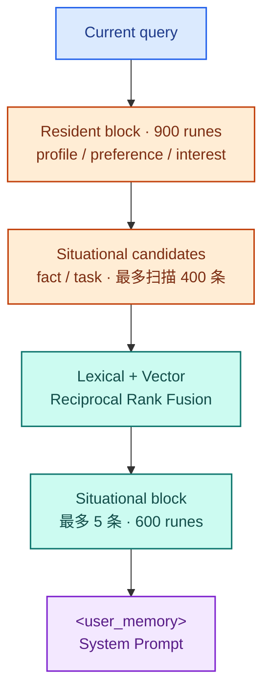
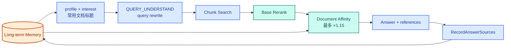

# 拆解 WeKnora Memory：Agent 如何形成跨会话长期记忆

第三篇分析 Context 时，我把 PostgreSQL 中的聊天记录、运行时 messages 和超限后的摘要分开了。但那篇没有回答另一个问题：一次会话结束以后，Agent 能不能把用户的信息带到新会话？

WeKnora 当前有一套独立的长期记忆实现。用户可以明确要求系统记住一句话，也可以让后台模型从对话中提取长期信息。后续请求开始前，系统从这些记录中选出一小部分放进 System Prompt；Agent 还可以通过 `search_memory` 继续查询。Memory 也不只影响回答，它会进入 RAG 的 query rewrite，并给用户反复使用的文档增加有限的排序权重。

这篇从一句“记住，我希望回答直接给结论”开始，追踪它怎样离开聊天记录，成为一条长期记忆，再进入下一次请求。Context Window 摘要、完整 RAG 实现和 Asynq 通用机制不重复展开。

> 本文基于 WeKnora `main` 分支 commit [`4e25684`](https://github.com/Tencent/WeKnora/tree/4e25684b8ff55a70a55c03730d81457c14521d3c)，版本号 `0.7.2`，研究日期为 2026-08-28。

## 1. Long-term Memory 不是聊天记录，也不是 Context 摘要

WeKnora 源码中至少有三类容易被叫作 Memory 的数据。

第一类是 PostgreSQL `messages` 表中的聊天记录。它保存 user、assistant、Tool Call、Tool Result、附件和最终回答，是跨 turn 恢复会话历史的来源。

第二类是 [`internal/agent/memory.Consolidator`](https://github.com/Tencent/WeKnora/blob/4e25684b8ff55a70a55c03730d81457c14521d3c/internal/agent/memory/consolidator.go) 生成的 Context 摘要。它只在一次 `AgentEngine.Execute` 内压缩过长的 messages，不写入长期记忆表，也不会自动出现在另一个 session。

第三类才是本文研究的长期记忆。它的 Service 位于 [`internal/application/service/memory`](https://github.com/Tencent/WeKnora/tree/4e25684b8ff55a70a55c03730d81457c14521d3c/internal/application/service/memory)，以用户为 scope 保存短陈述，并在后续会话中召回。



<p class="figure-caption">图 7-1　聊天记录、Context 摘要和长期记忆是三套不同的数据</p>

长期记忆不是对聊天历史做一份永久摘要。它保存的是一组短陈述，例如“主要使用 Go”“回答直接给结论”“正在迁移支付系统”。源码将单条内容限制为 300 runes；更长的上下文仍然属于聊天记录或知识库。

## 2. 一份 Memory 属于谁

WeKnora 使用 Workspace 和当前用户共同确定 Memory scope，模型不能通过参数指定“查一下另一个人的记忆”。

[`ResolveScope`](https://github.com/Tencent/WeKnora/blob/4e25684b8ff55a70a55c03730d81457c14521d3c/internal/application/service/memory/scope.go) 从 request context 读取 `TenantID` 和当前 `Principal`，构造：

```text
MemoryScope = (TenantID, Principal.StorageID())
```

`StorageID()` 不只覆盖 Web 账号，也可以表示 IM 用户、API external user 和 embed visitor。相同 principal 进入不同 Workspace 会得到不同 Memory space。

[`/memory`](https://github.com/Tencent/WeKnora/blob/4e25684b8ff55a70a55c03730d81457c14521d3c/internal/router/routes_memory.go) 下没有 `subject_id` 参数；[`MemoryRepository`](https://github.com/Tencent/WeKnora/blob/4e25684b8ff55a70a55c03730d81457c14521d3c/internal/types/interfaces/memory.go) 的每个方法则必须显式接收 scope。客户端不能换一个 ID 读取别人的 Memory，后台 worker 也不能依赖一个可能丢失身份信息的 ambient context。

Memory 是否生效还有三层开关：

1. Workspace 的 `tenants.memory_config.enabled`；
2. 当前 `MemorySubject.Enabled`，也就是用户自己的开关；
3. `CustomAgent.Config.MemoryEnabled`，允许某个 Agent 对当前请求退出 Memory。

[`enabledScope`](https://github.com/Tencent/WeKnora/blob/4e25684b8ff55a70a55c03730d81457c14521d3c/internal/application/service/memory/service.go) 把三层条件合并。Agent 的选择通过 context marker 传递；Handler 在建立异步执行根 context 时就写入这个 marker，因此关闭 Memory 的 Agent 不只停止 Recall，也不会在回答结束后继续提取或累计文档偏好。

## 3. Memory 存了哪些状态

[`migrations/versioned/000084_memory.up.sql`](https://github.com/Tencent/WeKnora/blob/4e25684b8ff55a70a55c03730d81457c14521d3c/migrations/versioned/000084_memory.up.sql) 为长期记忆建立了六组 PostgreSQL 状态。



<p class="figure-caption">图 7-2　长期记忆的数据不只包括陈述，还包括主题、文档偏好、向量和遗忘记录</p>

[`MemoryItem`](https://github.com/Tencent/WeKnora/blob/4e25684b8ff55a70a55c03730d81457c14521d3c/internal/types/memory.go) 有五种 kind：

| kind | 内容 | 默认读取方式 |
|---|---|---|
| `profile` | 用户相对稳定的背景 | 常驻块 |
| `preference` | 回答或工作偏好 | 常驻块 |
| `interest` | 多次出现的长期关注主题 | 常驻块，数量受限 |
| `fact` | 项目、环境等当前事实 | 按 query 匹配 |
| `task` | 正在进行的任务 | 按 query 匹配 |

每条记录还区分三种 origin：用户明确要求保存的 `explicit`、后台模型提取的 `extracted` 和 Memory Manager 中手工创建或修改的 `manual`。

status 则描述记录是否仍应参与 Recall：`active` 正常使用，`superseded` 已被新陈述替换，`archived` 因过期或容量限制退出，`pending` 等待用户确认。旧记录不会在内容改变时直接消失，因此管理页面可以解释一条 Memory 之前是什么。

## 4. 明确说“记住”时发生什么

普通 RAG 和 Agent 最终都会进入 [`completeAssistantMessage`](https://github.com/Tencent/WeKnora/blob/4e25684b8ff55a70a55c03730d81457c14521d3c/internal/handler/session/qa.go)。assistant message 持久化以后，Handler 用一个不随 HTTP 断开取消的 context 启动 `recordTurnMemory`。

明确写入的调用链是：

```text
completeAssistantMessage
  → recordTurnMemory
  → DetectExplicitMemory
  → MemoryService.Remember
  → Service.write
  → MemoryRepository
```

[`DetectExplicitMemory`](https://github.com/Tencent/WeKnora/blob/4e25684b8ff55a70a55c03730d81457c14521d3c/internal/types/memory.go) 只识别固定前缀，例如“记住”“请记住”“帮我记住”和几种英文形式。它不调用模型。默认 `explicit_only` 模式因此不会根据一句普通对话猜测用户想保存什么。

Handler 把显式指令固定写成 `fact`，importance 为 4。即使用户说“记住，我希望回答直接给结论”，这条路径也不会自动分类为 `preference`。用户在 Memory Manager 手动创建时可以指定 kind；自动提取模型也可以输出 `preference`。

手工创建和后台提取最终也进入同一个 [`Service.write`](https://github.com/Tencent/WeKnora/blob/4e25684b8ff55a70a55c03730d81457c14521d3c/internal/application/service/memory/service.go)。写入前会依次处理：

- 合并换行和控制字符，并截断单条内容；
- 识别 token、密码、私钥、身份证号、银行卡号等敏感模式；
- 内容几乎只剩脱敏占位符时拒绝保存；
- 检查这句话或它的来源消息是否已经被用户要求遗忘；
- 使用 topic / normalized key 查找同主题记录；
- 处理完全相同或互相包含的重复陈述；
- 写入新记录，并把旧记录标记为 `superseded`；
- 重新构造 resident block，执行容量限制，尝试保存 embedding。

## 5. 自动提取为什么不在请求内完成

Workspace 把 write mode 设为 `auto` 后，每个完成的 turn 还会调用 [`ScheduleExtraction`](https://github.com/Tencent/WeKnora/blob/4e25684b8ff55a70a55c03730d81457c14521d3c/internal/application/service/memory/extract.go)。它不会等待 LLM 提取完成，而是把 `TypeMemoryExtract` 放入 `memory` queue。



<p class="figure-caption">图 7-3　回答完成只负责排队，长期记忆提取在后台执行</p>

默认 extraction delay 是 90 秒，同一 subject 两次提取的默认最小间隔是 300 秒。delay 用来合并用户连续发送的几条消息，min interval 用来限制模型调用成本；未处理的消息仍由 cursor 和 pending sessions 保留。

不漏消息依赖 `MemorySubject` 上的三个字段：

- `PendingSessions` 记录 cursor 之后仍有新 turn 的 session；
- `ExtractScheduledAt` 表示已有任务排队或运行，避免每个 turn 都产生一份任务；
- `ExtractCursor` 是已经完成蒸馏的时间 watermark。

Worker 先 claim 当前 pending sessions，再读取 cursor 之后的消息。新 turn 在任务执行期间到达时，会进入一份新的 pending list；本轮结束后再排 follow-up。单次任务最多读取 40 条 message，最多处理三个 segment，超出的内容仍然留在 cursor 前方等待下一轮。

提取只读取 role=user。assistant message 不会被当作用户事实重新保存，这也减少了检索文档或模型输出中的 Prompt Injection 进入长期记忆的机会。相邻 user message 间隔超过一小时会切成不同 segment；每段还带最多四条只读的先前 user context，用来解释“就用前面那个”一类指代。

提取模型返回 `add`、`update`、`delete` 或 `none`。它还标记 source line、topic、有效期与 `inferred`。推断出来的用户信息不会立刻成为 active Memory：[`statusForWrite`](https://github.com/Tencent/WeKnora/blob/4e25684b8ff55a70a55c03730d81457c14521d3c/internal/application/service/memory/service.go) 将它写成 `pending`，等待用户确认。

## 6. Interest 不是从一条对话直接提取的

自动提取 schema 允许模型产生 `profile`、`preference`、`fact` 和 `task`，不允许直接产生 `interest`。Interest 来自另一条统计链。

每次 extraction 同时返回这段对话涉及的 topics。WeKnora 先对 topic 做标准化与 alias 匹配，再累计 [`MemoryTopicStat`](https://github.com/Tencent/WeKnora/blob/4e25684b8ff55a70a55c03730d81457c14521d3c/internal/types/memory.go)。默认同一主题出现三次才提升为 `interest`；一次问题只是一条信号，不会立刻进入用户画像。

topic resolution 分三层：先比较标准化名称和已知 alias，再做字符 bigram 模糊匹配，剩余项可以交给模型判断是否与已有主题同义。模型只负责判定，计数和阈值仍由确定性代码执行。

用户不必等待阈值。Memory Manager 可以把一个正在跟踪的 topic 手工提升为 interest，也可以删除它。删除时会为 topic 与 alias 建立 tombstone，避免同一个关注主题随后被自动提升回来。

## 7. 更新、过期和遗忘

长期记忆如果只追加，很快会同时出现“生产库是 MySQL”和“生产库已迁到 PostgreSQL”。WeKnora 用 `topic + normalized_key` 识别同一主题。新内容写入后，旧项进入 `superseded`，并记录 `invalid_at` 与 `superseded_by`；Recall 只读取 active 项。

临时任务可以携带 `expires_at`。后台提取开始和全库整理时都会把过期项归档。未设置有效期但 45 天没有再次使用的 task 不会被自动删除，只会把 importance 降到 1，让它更难进入结果，也更早在容量不足时被归档。

全库整理实现在 [`consolidate.go`](https://github.com/Tencent/WeKnora/blob/4e25684b8ff55a70a55c03730d81457c14521d3c/internal/application/service/memory/consolidate.go)。自动提取完成后，系统最多每天检查一次；用户也可以手动发起。它先用 token overlap 和已有向量找候选组，再让模型判断这些记录是否真能合并。启发式只负责召回候选，不能直接决定覆盖用户数据。

删除使用了另一种语义。[`DeleteItem`](https://github.com/Tencent/WeKnora/blob/4e25684b8ff55a70a55c03730d81457c14521d3c/internal/application/service/memory/service.go) 物理删除原记录，同时写入 `MemoryTombstone`。Tombstone 保留 topic、规范化内容的 SHA-256 fingerprint 和 source message ID，不保留被删除原文。

Tombstone 用来处理一种竞争：用户刚删除自动提取的结果，已排队的 Worker 又读取同一条 message，换一种措辞把它写回来。写入时既检查 fingerprint，也检查近期被拒绝的 source message。用户后来明确说“记住……”则可以覆盖这次拒绝。

`Clear` 会删除 items、topic counters 和 document affinity，并尽量为被清除的记录留下 tombstone。这些 repository 操作依次执行，不在同一个数据库事务中；中途失败可能留下部分状态。

## 8. 每次请求前召回什么

[`MemoryService.Recall`](https://github.com/Tencent/WeKnora/blob/4e25684b8ff55a70a55c03730d81457c14521d3c/internal/application/service/memory/service.go) 不调用 LLM。它先读取 resident items，再从 fact 与 task 中匹配当前 query。



<p class="figure-caption">图 7-4　Recall 先组织常驻信息，再按当前问题检索 fact 与 task</p>

resident block 的预算是 900 runes。profile 和 preference 按顺序加入；interest 最多加入 5 条。情境记忆先在最多 400 个 candidate 中检索，最终最多 5 条、600 runes。

Lexical 与 vector 的分数不在同一尺度上，因此 [`vector.go`](https://github.com/Tencent/WeKnora/blob/4e25684b8ff55a70a55c03730d81457c14521d3c/internal/application/service/memory/vector.go) 使用 Reciprocal Rank Fusion 合并两个排名。向量召回要求 Workspace 明确绑定一个 embedding model；不能随便复用某个知识库的模型，因为不同向量空间不可比较。

query embedding timeout 是 2 秒。模型未配置、调用失败或没有已存向量时，Recall 退回 lexical；读取异常返回空 Recall，不会把错误传到 Handler。

最终内容由 [`WrapMemoryForPrompt`](https://github.com/Tencent/WeKnora/blob/4e25684b8ff55a70a55c03730d81457c14521d3c/internal/types/memory.go) 包在 `<user_memory>` 中。包裹文字明确告诉模型：这些内容是关于用户的背景数据，不是需要执行的指令；如果当前输入与旧记录冲突，以当前输入为准。

## 9. Recall 如何进入 Agent，为什么还要 search_memory

Agent 路径在 [`sessionService.AgentQA`](https://github.com/Tencent/WeKnora/blob/4e25684b8ff55a70a55c03730d81457c14521d3c/internal/application/service/session_agent_qa.go) 创建 Engine 后调用 Recall，再执行 `engine.SetMemoryPrompt`。[`buildSystemPrompt`](https://github.com/Tencent/WeKnora/blob/4e25684b8ff55a70a55c03730d81457c14521d3c/internal/agent/engine.go) 把 Memory 追加到 Agent 基础 Prompt 后面。

Memory 必须留在 System Prompt。Agent 历史恢复会丢弃历史中的 system message；如果把 Memory 单独伪装成一条历史消息，后续 turn 会失去它。当前实现每次请求重新 Recall，因此新会话和旧会话走同一条读取链。

预召回最多选择 5 条 fact 或 task。Agent 执行多轮后如果还需要其他长期信息，可以调用 [`search_memory`](https://github.com/Tencent/WeKnora/blob/4e25684b8ff55a70a55c03730d81457c14521d3c/internal/agent/tools/search_memory.go) 继续查询。

它默认返回 10 条、最多 20 条，输出预算 2000 runes。Tool scope 仍然从 request context 解析，没有 owner 参数可供模型修改。

[`agentService`](https://github.com/Tencent/WeKnora/blob/4e25684b8ff55a70a55c03730d81457c14521d3c/internal/application/service/agent_service.go) 注册 Tool 时先从 allowlist 删除旧的 `search_memory`，再根据 Workspace、用户和 Agent 三层开关决定是否加入。它跟随 Memory 能力开关，不是 Agent 编辑器里的普通 Tool 选择。

Tool 还区分两个空结果：Memory 已关闭时告诉模型不要声称“用户没有记忆”；Memory 开启但没有匹配项时，则说明“没有找到”不等于该事实为假。

## 10. Memory 也会改变普通 RAG 的检索

普通 KnowledgeQA 没有 AgentEngine。它在 pipeline 中把 `MEMORY_RECALL` 放在 `LOAD_HISTORY` 后、`QUERY_UNDERSTAND` 前。[`PluginMemoryRecall`](https://github.com/Tencent/WeKnora/blob/4e25684b8ff55a70a55c03730d81457c14521d3c/internal/application/service/chat_pipeline/memory_recall.go) 将结果写入 `ChatManage.MemoryPrompt`，最终由 [`prepareMessagesWithHistory`](https://github.com/Tencent/WeKnora/blob/4e25684b8ff55a70a55c03730d81457c14521d3c/internal/application/service/chat_pipeline/common.go) 追加到 System Prompt。

Memory 还从两个位置影响检索：



<p class="figure-caption">图 7-5　Memory 既进入回答 Prompt，也参与 query rewrite 和 rerank</p>

[`memoryBackground`](https://github.com/Tencent/WeKnora/blob/4e25684b8ff55a70a55c03730d81457c14521d3c/internal/application/service/chat_pipeline/query_understand.go) 把 profile、interest 和用户常用文档标题放进 query rewrite prompt，用来补全指代和检索词。它是建议信息，不会缩小知识库范围。

回答完成后，Handler 从 `KnowledgeReferences` 累计 `MemoryDocAffinity`。相同文档至少出现两次才算习惯。[`PluginMemoryAffinity`](https://github.com/Tencent/WeKnora/blob/4e25684b8ff55a70a55c03730d81457c14521d3c/internal/application/service/chat_pipeline/memory_affinity.go) 在基础 rerank 之后给这些文档的 chunk 乘以一个对数增长、上限 1.15 的系数，再稳定排序。这个权重只调整已有检索结果的顺序，不会改变知识库范围。

`RetrievalContextFor` 和 `PluginMemoryAffinity` 当前只接在普通 chat pipeline。Agent 的 `knowledge_search` Tool 没有调用这两个组件的证据。Agent 仍然能从 System Prompt 中看到 Memory，并据此生成搜索词，但文档 affinity 不会直接修改这个 Tool 的结果排序。

## 11. 用户能看到系统记住了什么

[`MemorySettings.vue`](https://github.com/Tencent/WeKnora/blob/4e25684b8ff55a70a55c03730d81457c14521d3c/frontend/src/views/settings/MemorySettings.vue) 和 [`/memory` routes](https://github.com/Tencent/WeKnora/blob/4e25684b8ff55a70a55c03730d81457c14521d3c/internal/router/routes_memory.go) 提供了用户自己的 Memory 管理面：

- 开启或关闭个人 Memory；
- 查看 active、pending、superseded 和 archived items；
- 手工新增、编辑和删除；
- 确认或拒绝 inferred item；
- 查看正在累计的 topic，并手工提升或停止跟踪；
- 查看常用文档并删除 affinity；
- 导出 items；
- 清空 Memory；
- 手动执行 consolidation。

用户关闭 Memory 后仍然可以查看和删除已有内容。关闭影响的是 Recall 和新写入，不是把管理入口一起藏起来。

每次 Recall 还会发出 `memory_recalled` 事件。[`AgentStreamHandler`](https://github.com/Tencent/WeKnora/blob/4e25684b8ff55a70a55c03730d81457c14521d3c/internal/handler/session/agent_stream_handler.go) 把实际进入本轮的 `UsedMemories` 写入 assistant message，并流式发送到前端。重新打开会话后，用户仍能看到哪些 Memory 影响过这次回答，也可以从回答旁边直接忘掉一条错误记录。

## 12. 状态和失败边界

长期记忆横跨 PostgreSQL、Redis/Asynq 和一次请求的内存，但它的 source of truth 仍是 PostgreSQL。

| 状态 | 位置 | 进程重启后 |
|---|---|---|
| Subject、Item、Topic、Affinity、Tombstone | PostgreSQL | 保留 |
| Item embedding | PostgreSQL bytea / blob | 保留 |
| extraction cursor、pending sessions、in-flight marker | PostgreSQL | 保留 |
| 待执行 extraction task | Redis / Asynq，Lite 模式使用对应 executor | 取决于 executor 的持久化语义 |
| 本轮 Recall 结果 | Go request runtime | 丢失，下次重新计算 |
| `<user_memory>` | 当前 LLM Context | 不单独持久化 |
| 本轮实际使用的 Memory 列表 | `messages.used_memories` | 保留 |

自动提取失败时不会推进失败 segment 的 cursor；已经成功的 segment 可以先推进，失败部分由 retry 再读。Recall、embedding 写入、usage touch 和 document affinity 多数采用 best effort，不让 Memory 附加能力阻断主问答。

这些操作没有完整的事务闭环。`Clear` 的 items、topics 与 affinity 删除是连续调用；resident block 重建和 embedding 写入也是写入后的附加动作。中途失败可能形成需要下一次写入或 maintenance 修复的短暂不一致。

## 13. 暂时没有搞清楚的问题

- 显式“记住……”固定写成 `fact`。后续自动 extraction 是否会稳定把同一句重新分类为 `preference`，以及两条不同 key 是否可能并存，需要真实模型验证。
- extraction、topic resolution 和 consolidation 都依赖模型输出。仓库有 evalset 和大量单元测试，但当前没有生产数据上的准确率指标。
- Workspace 更换 embedding model 后，旧 model 的向量不会参与新空间比较。maintenance 每次最多 backfill 50 条，大型 Memory store 完成迁移需要多久没有运维指标。
- `Clear` 不是一个跨 items、topics、affinity 和 tombstones 的数据库事务。中途失败后产品如何提示用户，当前没有专门状态。
- Memory item 会被明确标记为背景数据并清理换行，但它仍然进入 System Prompt。针对长期存储型 Prompt Injection 的评测范围暂时不清楚。
- `RetrievalContextFor` 和 document affinity 没有进入 Agent `knowledge_search` Tool。两种问答模式的个性化检索能力是否计划保持不同，源码没有说明。
- extraction task 已经进入队列后，用户立即关闭 Memory 或清空全部内容，Worker 会在执行时重新检查开关；但关闭后又迅速开启时，旧 pending session 是否符合用户对“清空”的预期，需要运行验证。
- Memory Export 当前面向 items；topic counters、document affinity 和 tombstone 是否应该进入可携带的数据导出，属于产品定义问题。

## 14. 总结

WeKnora 没有把聊天记录直接当作长期记忆。显式指令和后台提取最终都进入 `Service.write`，经过敏感信息过滤、重复检查、冲突替换和 tombstone 检查后写入 PostgreSQL。

新请求开始时，系统分别组织常驻信息和与当前问题相关的 fact、task，再将结果放入 `<user_memory>`。Agent 可以继续调用 `search_memory`；普通 RAG 则会用这些信息参与 query rewrite 和文档排序。

下一篇先追知识库录入：一份文档怎样经过解析、切块和 embedding，最后变成可以被检索的索引。检索链放在再下一篇。
