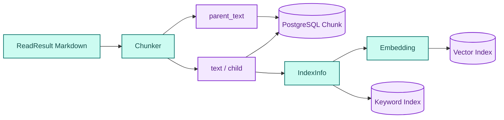
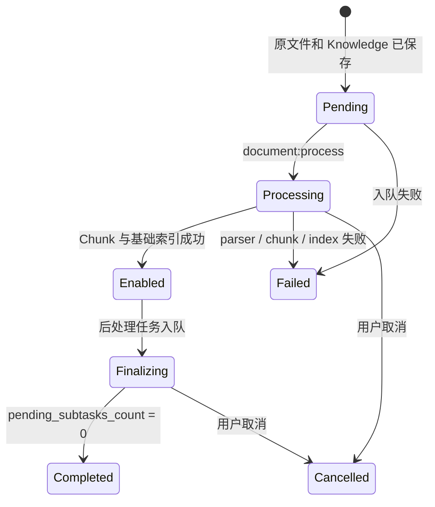
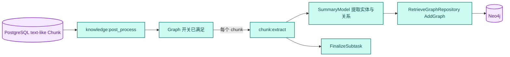

# 拆解 WeKnora 知识库：一份文档是如何变成可检索索引的

上传 PDF 后接口马上返回，但这份文档还不能检索。此时原文件已经保存，`Knowledge` 行也已经创建；chunk、embedding、vector index，甚至 Graph RAG 都还在后面的异步任务里。

> 本文基于 WeKnora `main` 分支 commit [`4e25684`](https://github.com/Tencent/WeKnora/tree/4e25684b8ff55a70a55c03730d81457c14521d3c)，版本 `0.7.2`。研究日期：2026-09-02，2026-09-05 复核。

## 1. 上传成功，到底完成了什么

文件入口是 `POST /knowledge-bases/{id}/knowledge/file`。`CreateKnowledgeFromFile` 在请求内做类型校验、重复检测、配额检查和原文件保存，然后创建一条 `parse_status=pending`、`enable_status=disabled` 的 Knowledge，最后投递 `document:process`。

所以 HTTP 成功只表示“录入任务被接收”。入队失败时，Service 会把这条 Knowledge 标记为失败，但不会把已经创建的记录假装成不存在。[`CreateKnowledgeFromFile`](https://github.com/Tencent/WeKnora/blob/4e25684b8ff55a70a55c03730d81457c14521d3c/internal/application/service/knowledge_create.go#L25-L294)

## 2. WeKnora 能录入哪些内容与文件格式

| 内容 | 进入哪条路径 |
| --- | --- |
| 上传文件 | 保存原文件后投递 `document:process` |
| 网页 URL | Reader 读取 URL，再走 `document:process` |
| 文件 URL | Worker 下载、保存，再走 `document:process` |
| 手工文本 | 发布后走 `manual:process` |
| passage | 直接组装 `ParsedChunk` |
| FAQ | 写 `ChunkTypeFAQ` 和 FAQ index |
| Data Source | connector 最终复用文件或 URL 入口 |

文件上传、文件 URL 和下载后的二次校验共用同一个白名单：

| 类别 | 扩展名 |
| --- | --- |
| 文档 | `pdf`、`txt`、`doc`、`docx`、`epub`、`md`、`markdown` |
| 网页文档 | `html`、`htm`、`mhtml` |
| 表格与演示 | `csv`、`xls`、`xlsx`、`ppt`、`pptx`、`json` |
| 图片 | `png`、`jpg`、`jpeg`、`gif` |
| 音频 | `mp3`、`wav`、`m4a`、`flac`、`ogg` |

视频被显式拒绝。白名单不等于 parser 的能力总表：builtin DocReader 还列了 `xmind`、`bmp`、`tiff`、`webp`，但上传入口不收；部署中真正能处理什么，还取决于为该格式选中的 parser 是否可用。[`supportedImportFileExtensions`](https://github.com/Tencent/WeKnora/blob/4e25684b8ff55a70a55c03730d81457c14521d3c/internal/application/service/knowledge_util.go#L25-L82) [`parser engines`](https://github.com/Tencent/WeKnora/blob/4e25684b8ff55a70a55c03730d81457c14521d3c/internal/infrastructure/docparser/engines.go)

## 3. 文件、URL、手工文本、passage、FAQ、Data Source 分别从哪里进入

普通文件、网页 URL 和文件 URL 最终都会让 Reader 产出 Markdown。区别只是内容在哪里拿：上传文件从 File Service 读 bytes；URL 交给 Reader；文件 URL 在 Worker 中再次 SSRF 校验、下载并落存储。

手工文本、passage 和 FAQ 不能装进这个模型。手工文本的 draft 只保存内容，publish 才生成 chunk；passage 已经是调用方切好的文本，直接跳过 Reader；FAQ 的每个问答本身就是检索单元，不走文档 parser 和 chunk strategy。Data Source 也不是另一套索引器，connector 拿到 bytes 时调用文件入口，只有 URL 时调用 URL 入口。[`CreateKnowledgeFromURL`](https://github.com/Tencent/WeKnora/blob/4e25684b8ff55a70a55c03730d81457c14521d3c/internal/application/service/knowledge_create.go#L296-L711) [`processDocumentFromPassage`](https://github.com/Tencent/WeKnora/blob/4e25684b8ff55a70a55c03730d81457c14521d3c/internal/application/service/knowledge_process.go#L116-L158) [`FAQ service`](https://github.com/Tencent/WeKnora/blob/4e25684b8ff55a70a55c03730d81457c14521d3c/internal/application/service/knowledge_faq.go) [`ingestItem`](https://github.com/Tencent/WeKnora/blob/4e25684b8ff55a70a55c03730d81457c14521d3c/internal/application/service/datasource_service.go#L1236-L1378)

## 4. 同步创建阶段：校验、去重、原文件、Knowledge、异步任务

上传请求不是把文件直接交给 parser。Service 先拒绝 FAQ 知识库的文件、视频和不在白名单内的类型；计算整文件 hash；用文件名、类型、大小和 hash 查重；检查存储配额。随后它保存原始文件、写入 Knowledge、绑定 tag，并把文件路径、类型和 process override 放进任务 payload。

数据库写入失败时，Service 会尝试删除刚保存的文件。这个顺序说明原文件和 Knowledge 不是同一事务，只是有补偿清理。[`CreateKnowledgeFromFile`](https://github.com/Tencent/WeKnora/blob/4e25684b8ff55a70a55c03730d81457c14521d3c/internal/application/service/knowledge_create.go#L66-L294)

## 5. Worker 如何恢复任务，并按来源分流

`ProcessDocument` 消费任务时不会只信 payload。它重新从 PostgreSQL 读取 Knowledge：`completed` 直接返回，`deleting` 或 `cancelled` 停止；其余有效记录进入 `processing`。这样同一个任务重试、用户重新解析和延迟消费不会靠内存状态判断。

接着 Worker 根据来源选分支：`file_path` 从存储取内容，`url` 让 Reader 抓取，`file_url` 先下载，`passages` 直接作为已解析的 chunk。所有走 Reader 的内容最终汇合为 `ReadResult`，再送给 chunker。[`ProcessDocument`](https://github.com/Tencent/WeKnora/blob/4e25684b8ff55a70a55c03730d81457c14521d3c/internal/application/service/knowledge_process.go#L3294-L3470)

## 6. Parser 如何选择；`process_config` 怎样覆盖知识库默认配置

知识库保存默认 `ChunkingConfig`、VLM、ASR、问题生成、抽取等配置。一次上传还可以带 `process_config`；`ResolveProcessConfig` 在 Worker 中把两者合并为 `EffectiveProcessConfig`。单次配置优先，但不是所有字段简单替换：例如 VLM 和问题生成的自定义指令为空时会保留知识库默认值。

| 配置 | 实际影响 |
| --- | --- |
| `parser_engine_rules` | 按扩展名选择 builtin、simple、anydoc、MinerU、PaddleOCR-VL 等 parser；Excel 可指定首行是否当表头。 |
| `parser_engine_overrides` | 传 parser 专用参数，例如 `pdf_force_scanned=true`。 |
| `chunk_size`、`chunk_overlap`、`separators`、`strategy` | 影响 Reader 之后的切块。 |
| `token_limit`、`languages`、parent-child 参数 | 限制 chunk token、提示启发式规则、开启父子两层。 |
| `vlm_config`、`asr_config` | 图片理解和音频转写的模型与开关。 |
| `extract_config`、`graph_enabled` | 基础索引后的图抽取。 |

没有 rule 命中时，Reader 选择默认 builtin；simple 格式在未显式指定 parser 时可以由 Go 原生处理。parser 负责读内容，不能决定 chunk 的大小或切分策略。[`ChunkingConfig`](https://github.com/Tencent/WeKnora/blob/4e25684b8ff55a70a55c03730d81457c14521d3c/internal/types/knowledgebase.go#L234-L279) [`KnowledgeProcessOverrides`](https://github.com/Tencent/WeKnora/blob/4e25684b8ff55a70a55c03730d81457c14521d3c/internal/types/knowledge_process.go) [`ResolveProcessConfig`](https://github.com/Tencent/WeKnora/blob/4e25684b8ff55a70a55c03730d81457c14521d3c/internal/application/service/knowledge_process_config.go)

## 7. PDF / Office / 表格 / 图片 / 音频分别怎样转成可切分内容

`convert` 统一构造 `ReadRequest`，把文件名、类型、bytes 或 URL、选择出的 parser 和 override 交给 Reader。Reader 返回的核心是 Markdown；后面的流程不再区分 PDF、DOCX 或网页。

- `md`、`txt` 直接成为 Markdown；`csv`、`json` 由 Simple reader 转为 Markdown 表格或文本。
- Office、PDF、网页、EPUB 等通常交给 DocReader 或配置的外部 parser。
- 图片先成为 Markdown 图片引用，原始 bytes 随 `ImageRefs` 返回并保存。开启多模态后，图片还会派生 OCR / caption chunk。
- 音频先保留在 `ReadResult.AudioData`，后续 ASR 转写得到文本；没配置 ASR 的音频上传会被拒绝。

[`SimpleFormatReader`](https://github.com/Tencent/WeKnora/blob/4e25684b8ff55a70a55c03730d81457c14521d3c/internal/infrastructure/docparser/builtin_converter.go#L48-L112) [`convert`](https://github.com/Tencent/WeKnora/blob/4e25684b8ff55a70a55c03730d81457c14521d3c/internal/application/service/knowledge_process.go) [`image multimodal`](https://github.com/Tencent/WeKnora/blob/4e25684b8ff55a70a55c03730d81457c14521d3c/internal/application/service/image_multimodal.go#L430-L530)

## 8. Markdown 怎样切成 chunk：策略、参数、parent-child

默认 splitter 使用 512 字符、80 字符 overlap，优先按 `\n\n`、`\n`、`。` 断开。`token_limit` 有值时会按语言折算出更小的字符预算。

| `strategy` | 实际行为 |
| --- | --- |
| 空、`legacy`、`recursive` | 递归切分；`recursive` 是兼容别名。 |
| `heading` | 先沿 Markdown heading 切，失败再退回递归。 |
| `heuristic` | 先找章节标记、分页等边界，失败再退回递归。 |
| `auto` | 先分析标题密度和章节特征，再挑 heading 或 heuristic；最终仍用递归兜底。 |

开启 parent-child 后，chunker 先切默认 4096 的 parent，再在每个 parent 内切默认 384 的 child。child 参与匹配；parent 只保存在 PostgreSQL，在检索阶段补回上下文。不开启时只有普通 text chunk，并靠 `PreChunkID` / `NextChunkID` 保留相邻关系。[`NormalizeSplitterConfig`](https://github.com/Tencent/WeKnora/blob/4e25684b8ff55a70a55c03730d81457c14521d3c/internal/infrastructure/chunker/strategy.go#L181-L258) [`strategy selection`](https://github.com/Tencent/WeKnora/blob/4e25684b8ff55a70a55c03730d81457c14521d3c/internal/infrastructure/chunker/strategy.go#L273-L318)

## 9. chunk 怎样写 PostgreSQL、embedding、vector / keyword index

`processChunks` 先清同一 Knowledge 的旧 chunk、旧检索索引和旧图数据，再创建本轮 chunk。parent 和普通 text / child chunk 都写 PostgreSQL；只有普通 text 或 child 会生成 `IndexInfo`，送给 `RetrieveEngine.BatchIndex`。parent 不参与基础向量召回。

embedding 输入不是裸 `Chunk.Content`：它带文档标题，优先使用包含 heading breadcrumb 的内容。Knowledge 的用户 metadata 留在 Knowledge 行，不会重复拼进每个 embedding 输入里。

图 8-1　parent 会保存，但真正进入基础检索索引的是 text / child chunk

[`processChunks`](https://github.com/Tencent/WeKnora/blob/4e25684b8ff55a70a55c03730d81457c14521d3c/internal/application/service/knowledge_process.go#L244-L680) [`buildIndexContent`](https://github.com/Tencent/WeKnora/blob/4e25684b8ff55a70a55c03730d81457c14521d3c/internal/application/service/knowledge_index_content.go) [`RetrieveEngine`](https://github.com/Tencent/WeKnora/blob/4e25684b8ff55a70a55c03730d81457c14521d3c/internal/types/interfaces/retriever.go)

## 10. 基础索引后，状态怎样从 `pending` 走到 `enabled`、`finalizing`、`completed`

索引成功时，`finalizeIndexedKnowledgeState` 先把 `enable_status` 写成 `enabled`。普通检索这时已经可用，但 `parse_status` 还可能是 `processing`：摘要、问题生成、图片处理、图抽取等任务尚未结束。

`KnowledgePostProcessService.Handle` 先把状态原子切到 `finalizing`，同时写 `pending_subtasks_count`。每个子任务到达终态后调用 `FinalizeSubtask` 减一；计数归零并且记录仍是 `finalizing`，才写入 `completed`。

图 8-2　`enabled` 表示基础检索可用，`completed` 才表示后处理计数已经收敛

[`finalizeIndexedKnowledgeState`](https://github.com/Tencent/WeKnora/blob/4e25684b8ff55a70a55c03730d81457c14521d3c/internal/application/service/knowledge_process.go#L166-L203) [`FinalizeSubtask`](https://github.com/Tencent/WeKnora/blob/4e25684b8ff55a70a55c03730d81457c14521d3c/internal/application/repository/knowledge.go#L555-L627)

## 11. Graph RAG 怎样按 chunk 抽取并写 Neo4j

Graph RAG 发生在普通 index 之后，不经过 `RetrieveEngine.BatchIndex`。`knowledge:post_process` 从 Knowledge 的 chunk 中只保留 `text`、`image_ocr`、`image_caption`，每块创建一个 `chunk:extract` 任务。parent、FAQ 和图片占位 chunk 不在 fan-out 里。

图 8-3　Graph RAG 逐 chunk 抽取图数据，基础索引不等待它的结果

任务真的入队要同时满足三层条件：知识库的 `GraphEnabled` 和 `ExtractConfig.Enabled` 都开启；本次 `process_config` 没有覆盖关闭它们；部署设置 `NEO4J_ENABLE=true`。后处理会比较计划任务数和实际入队数，没入队的计数会立即释放，避免 Knowledge 永远停在 `finalizing`。

Worker 重新读取 chunk、Knowledge 和知识库配置，拿 `SummaryModelID` 调 extractor。模型输入是当前 `chunk.Content`，不是 embedding 文本；返回 `GraphData` 后，服务把来源 Chunk ID 附到 node 上，并以 `{KnowledgeBaseID, KnowledgeID}` 作为 namespace 写进 Neo4j。每个 chunk 各自写事务，整份文档没有跨 chunk 的图事务。

图抽取最终失败也会释放 subtask 计数，不会把已 `enabled` 的 Knowledge 改回 `failed`。结果是：一份 `completed` 文档可能只有部分 chunk 产生图数据；这是基础检索与图谱后处理分开计算成功条件的结果。[`graph fan-out`](https://github.com/Tencent/WeKnora/blob/4e25684b8ff55a70a55c03730d81457c14521d3c/internal/application/service/knowledge_post_process.go#L139-L221) [`NewChunkExtractTask`](https://github.com/Tencent/WeKnora/blob/4e25684b8ff55a70a55c03730d81457c14521d3c/internal/application/service/extract.go#L83-L124) [`ChunkExtractService.Handle`](https://github.com/Tencent/WeKnora/blob/4e25684b8ff55a70a55c03730d81457c14521d3c/internal/application/service/extract.go#L222-L379) [`Neo4jRepository.AddGraph`](https://github.com/Tencent/WeKnora/blob/4e25684b8ff55a70a55c03730d81457c14521d3c/internal/application/repository/retriever/neo4j/repository.go#L45-L115)

## 12. 失败、重试、重新解析和删除怎样清理旧数据

parser、chunk 或基础索引失败时，Knowledge 会进入 `failed`。索引阶段失败后，Service 尝试删除本轮写入的 chunk 和 index；这是补偿，不是跨存储事务回滚。

重新解析沿用同一个 Knowledge ID。普通文档会先清旧 chunk、Retrieve Engine index 和 Neo4j 图数据，再投递新任务；`processChunks` 自己也会再做一次幂等清理。删除 Knowledge 时，Service 先置 `deleting`，然后清任务、文件、chunk、索引和图数据；图数据删除失败会让删除返回错误，Knowledge 行暂时保留以便重试。[`processChunks cleanup`](https://github.com/Tencent/WeKnora/blob/4e25684b8ff55a70a55c03730d81457c14521d3c/internal/application/service/knowledge_process.go#L275-L304) [`reparse cleanup`](https://github.com/Tencent/WeKnora/blob/4e25684b8ff55a70a55c03730d81457c14521d3c/internal/application/service/knowledge_delete.go#L694-L778) [`DeleteKnowledge`](https://github.com/Tencent/WeKnora/blob/4e25684b8ff55a70a55c03730d81457c14521d3c/internal/application/service/knowledge_delete.go#L58-L170)

## 13. 最终哪些数据留在哪些存储里

| 数据 | 存储 | 用途 |
| --- | --- | --- |
| 原始文件 | File Service | 重解析、下载、图片引用 |
| Knowledge、状态、metadata | PostgreSQL | 录入流程的权威状态 |
| Chunk、parent relation、相邻关系 | PostgreSQL | 正文和检索后的上下文补全 |
| document / post-process task | Redis / Asynq，或 Lite executor | 异步执行与重试 |
| vector / keyword index | 配置的 Retrieve Engine backend | 基础召回 |
| FAQ Chunk / index | PostgreSQL + Retrieve Engine | FAQ 专用召回 |
| graph node / relation | Neo4j | 实体关系检索与回查正文 |

## 14. 暂时没有搞清楚的问题

- 上传白名单和每个部署实际启用的 parser engine 不是同一个集合。远端 parser 的版本、容量和失败重试策略需要运行配置佐证。
- PostgreSQL、文件存储、检索后端和 Neo4j 之间没有跨存储事务。部分清理失败后的 orphan 数据只能靠故障注入验证。
- 静态代码可以确认 Graph RAG 允许部分失败后进入 `completed`，但没有找到面向用户的“图谱不完整”汇总状态。
- Data Source 的增量同步、远端删除和重建策略属于 connector 的独立链路，本篇只追到它复用 Knowledge 录入入口为止。
