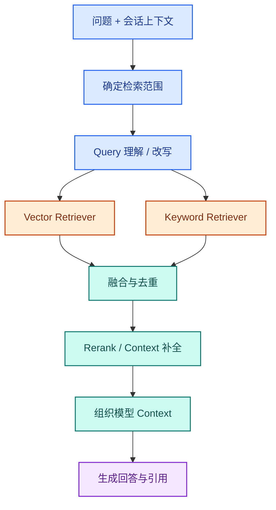
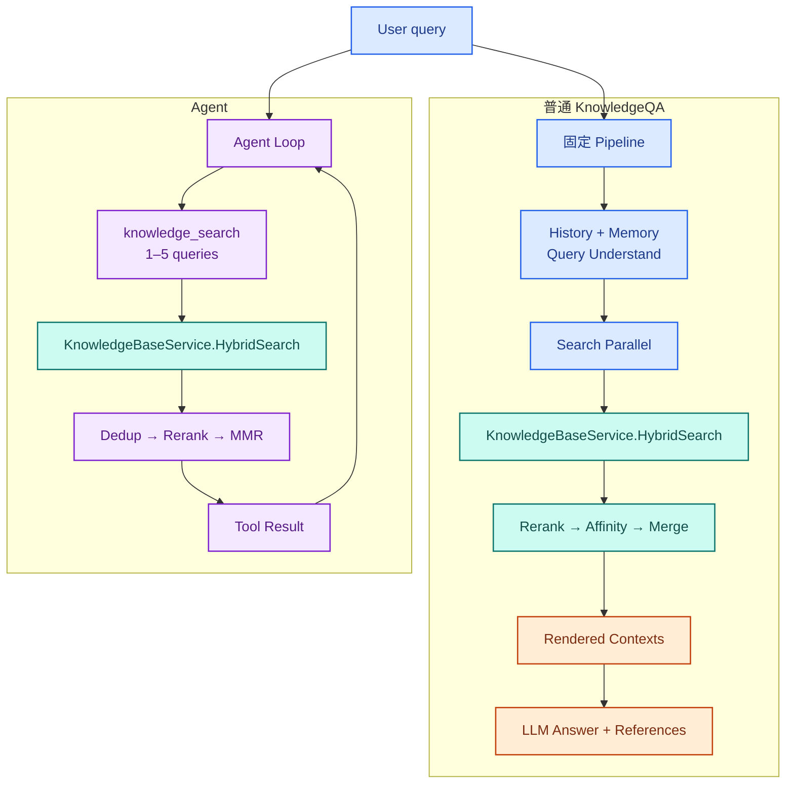
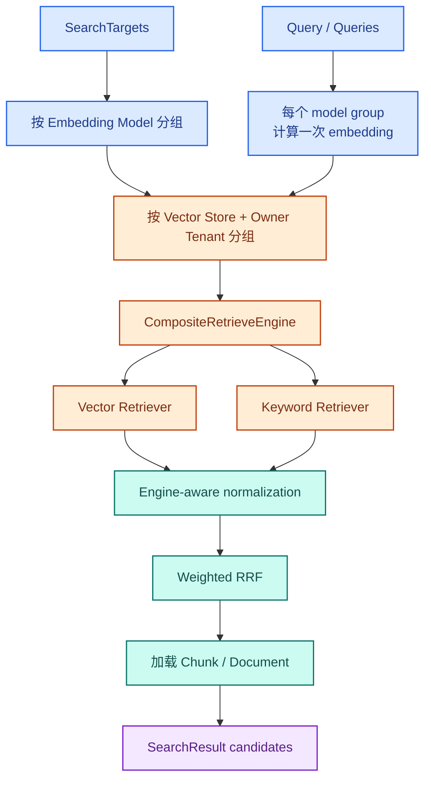
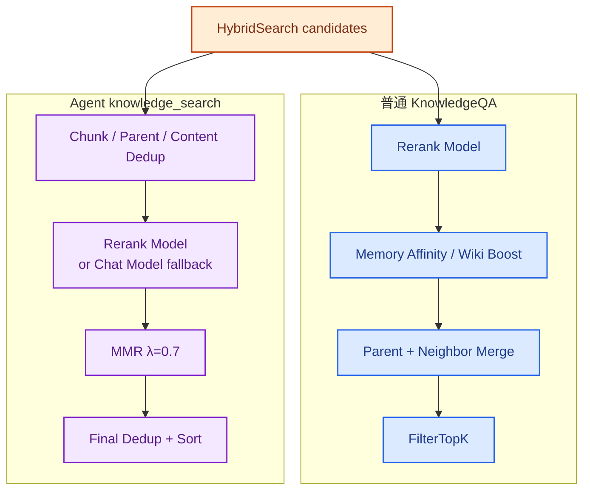
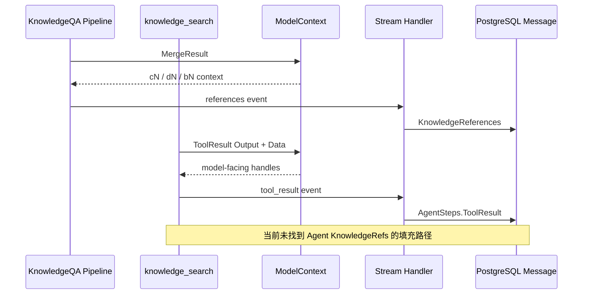

# 拆解 WeKnora RAG：一次知识库检索是如何完成的

`sessionService.KnowledgeQA` 和 Agent 的 `knowledge_search` 最终都会调用 `KnowledgeBaseService.HybridSearch`。前者在固定 pipeline 里先做 query understand；后者由 ReAct loop 决定何时搜索、用几个 query。HybridSearch 返回候选后，普通路径继续 Merge，Agent 则构造 Tool Result。



<p class="figure-caption">图 9-1　HybridSearch 前后还有 scope、query、上下文和引用处理</p>

两条路径里交接的数据对象相同：

```text
Request
→ SearchTargets
→ Query / Queries
→ SearchResult candidates
→ Rerank result
→ Rendered Contexts / Tool Result
→ Message state
```

> 本文基于 WeKnora `main` 分支 commit [`4e25684`](https://github.com/Tencent/WeKnora/tree/4e25684b8ff55a70a55c03730d81457c14521d3c)，版本号 `0.7.2`，研究日期为 2026-09-01。

## 1. 请求先分成两条调用链

[`sessionService.KnowledgeQA`](https://github.com/Tencent/WeKnora/blob/4e25684b8ff55a70a55c03730d81457c14521d3c/internal/application/service/session_knowledge_qa.go) 在服务端装配固定 pipeline：

```text
LOAD_HISTORY（可选）
→ MEMORY_RECALL
→ QUERY_UNDERSTAND
→ CHUNK_SEARCH_PARALLEL
→ CHUNK_RERANK
→ WEB_FETCH（可选）
→ CHUNK_MERGE
→ FILTER_TOP_K
→ INTO_CHAT_MESSAGE
→ CHAT_COMPLETION_STREAM
```

Agent 不执行这条 pipeline。[`sessionService.AgentQA`](https://github.com/Tencent/WeKnora/blob/4e25684b8ff55a70a55c03730d81457c14521d3c/internal/application/service/session_agent_qa.go) 创建 AgentEngine，模型在 ReAct 循环中决定什么时候调用 `knowledge_search`、用几个 query、是否需要再次搜索。



<p class="figure-caption">图 9-2　两条路径只在 HybridSearch 汇合，前后的处理并不相同</p>

入口虽然分开，两个 Service 都会先把本次请求允许搜索的知识库整理成 `SearchTargets`。这是后面所有检索动作的边界。

## 2. Request 先变成 SearchTargets

模型不能把任意知识库 ID 交给检索层。请求进入 Session Service 时，Agent 配置、`@知识库`、`@文档` 和 tag scope 会被解析成 [`SearchTargets`](https://github.com/Tencent/WeKnora/blob/4e25684b8ff55a70a55c03730d81457c14521d3c/internal/types/search.go)。

一个 `SearchTarget` 表示整库搜索或指定文档搜索，并携带：

- `KnowledgeBaseID`；
- 知识库所属的 `TenantID`；
- 指定的 `KnowledgeIDs`；
- FAQ 或文档 tag；
- 是否跳过召回阈值。

[`buildSearchTargets`](https://github.com/Tencent/WeKnora/blob/4e25684b8ff55a70a55c03730d81457c14521d3c/internal/application/service/session_knowledge_qa.go) 在请求入口只计算一次。跨 Workspace 的共享知识库也在这里解析实际 owner tenant，后面的 Tool 和 Retriever 使用同一份 scope。

显式选中文档或 tag 时，Target 会设置 `DisableRecallThresholds`。vector 和 keyword 阈值暂时降为 0，让选定范围中的候选先进入 rerank，避免一条全局阈值把用户刚指定的文档全部过滤掉。

`knowledge_search` 的 `knowledge_base_ids` 只负责缩小这份范围。[`validateKnowledgeBaseIDsInSearchTargets`](https://github.com/Tencent/WeKnora/blob/4e25684b8ff55a70a55c03730d81457c14521d3c/internal/agent/tools/scope_authorization.go) 会拒绝越界或已经失效的 ID。模型看到的 `bN` 是本次请求的临时 handle，执行 Tool 前才恢复成真实 ID。

## 3. SearchTargets 确定后，再准备 query

普通路径的 [`PluginQueryUnderstand`](https://github.com/Tencent/WeKnora/blob/4e25684b8ff55a70a55c03730d81457c14521d3c/internal/application/service/chat_pipeline/query_understand.go) 接收当前问题、历史会话、图片和 Memory background，调用模型返回：

```text
RewriteQuery
Intent
ImageDescription
```

rewrite 未开启且没有图片时，这一步直接跳过。模型调用或结果解析失败时，`RewriteQuery` 保留原始问题。Intent 还可以让后面的检索阶段跳过，直接进入普通回答。

首次召回少于 `EmbeddingTopK` 时，[`query_expansion.go`](https://github.com/Tencent/WeKnora/blob/4e25684b8ff55a70a55c03730d81457c14521d3c/internal/application/service/chat_pipeline/query_expansion.go) 会用停用词删除、词序变化和关键短语生成本地 query 变体，再执行一轮搜索。这里不再调用模型。

Agent Tool 没有接入这两个组件。[`KnowledgeSearchInput`](https://github.com/Tencent/WeKnora/blob/4e25684b8ff55a70a55c03730d81457c14521d3c/internal/agent/tools/knowledge_search.go) 要求模型直接给出 1～5 个简短的语义 query，Tool 将它们原样交给搜索函数。多个 query 的结果汇总后，用拼接后的 query 做一次 rerank。

Tool description 强调“按语义搜索，不用于精确关键词查找”，这是对 Agent 选择工具和构造参数的约束。它的底层仍然调用 HybridSearch，vector 和 keyword 两路是否执行由知识库索引配置决定。

## 4. Query 和 SearchTargets 进入 HybridSearch

[`KnowledgeBaseService.HybridSearch`](https://github.com/Tencent/WeKnora/blob/4e25684b8ff55a70a55c03730d81457c14521d3c/internal/application/service/knowledgebase_search.go) 接收一个 primary KB ID 和 `SearchParams`，返回已经还原了文档、chunk 与分数的 `SearchResult`。这是两条调用链真正共用的部分。

进入 Retriever 之前，HybridSearch 会完成几项检查：

1. 将空的 `MatchCount` 归一为默认 TopK；
2. 加载并授权所有目标知识库；
3. 校验一次调用中的知识库是否使用相同 embedding model；
4. 按 `max(MatchCount × 5, DefaultRetrievalTopK) × KB 数量` 扩大候选池，上限 500；
5. 计算一次 query embedding；
6. 按 vector store 和 owner tenant 分组访问检索后端。

Agent 和普通 pipeline 在 HybridSearch 外层还会先按 embedding model 的实际名称与 endpoint 分组。相同模型的一组知识库共享一次 query embedding；不同 embedding space 分开检索，结果到上层再汇总。



<p class="figure-caption">图 9-3　SearchTargets 经过 model group 和 store group 后进入统一 Retriever</p>

分组结束后，每个 store group 都会拿到自己的 query embedding 和检索参数。接下来才是实际的 vector / keyword 召回。

## 5. Retriever 返回 SearchResult candidates

[`buildRetrievalParams`](https://github.com/Tencent/WeKnora/blob/4e25684b8ff55a70a55c03730d81457c14521d3c/internal/application/service/knowledgebase_search.go) 根据知识库 pipeline 和 Retriever capability 决定实际通道：

- Document KB 可以同时创建 vector 和 keyword 参数；
- FAQ KB 使用 FAQ vector index，不走 keyword index；
- wiki-only 或 graph-only KB 没有 vector/keyword index 时跳过；
- backend 不支持某种 Retriever 时，不创建对应参数。

业务层只依赖 [`RetrieveEngine`](https://github.com/Tencent/WeKnora/blob/4e25684b8ff55a70a55c03730d81457c14521d3c/internal/types/interfaces/retriever.go) 接口。PostgreSQL、SQLite、Elasticsearch、OpenSearch、Milvus、Qdrant、Weaviate、Tencent VectorDB 和 Doris 等实现通过 Registry 接入，HybridSearch 不为每一种数据库写一条业务分支。

如果只有一路结果，[`fuseOrDeduplicate`](https://github.com/Tencent/WeKnora/blob/4e25684b8ff55a70a55c03730d81457c14521d3c/internal/application/service/knowledgebase_search_fusion.go) 按 chunk ID 去重并保留最高原始分数。vector 与 keyword 都有结果时，它改用 weighted Reciprocal Rank Fusion：

```text
score = vectorWeight / (k + vectorRank)
      + keywordWeight / (k + keywordRank)
```

RRF 比较的是两路排名，不要求向量相似度和 BM25 分数处在同一数值范围。`k` 和两路权重来自 Workspace 的 `RetrievalConfig`。

多 store 检索由 [`retrieveFromStores`](https://github.com/Tencent/WeKnora/blob/4e25684b8ff55a70a55c03730d81457c14521d3c/internal/application/service/knowledgebase_search_fanout.go) 执行，最大并发为 4，每组默认超时 30 秒。不同 engine 的结果先归一到 `[0,1]`；任一 store group 返回错误时，这次底层 fan-out 整体失败。

RRF 的输出还只是候选 ID 和分数。HybridSearch 接着加载对应的 chunk 和 document，把它们还原成 `SearchResult`。这批结果是否要补 parent、relation 和相邻块，由下一层参数决定。

## 6. SearchResult 是否补全上下文

HybridSearch 把 index hit 还原为 `SearchResult` 时，可以附带 parent、relation 和前后相邻块。[`processSearchResults`](https://github.com/Tencent/WeKnora/blob/4e25684b8ff55a70a55c03730d81457c14521d3c/internal/application/service/knowledgebase_search_results.go) 通过 `SkipContextEnrichment` 控制这个行为。

普通 pipeline 调用 HybridSearch 时设置 `SkipContextEnrichment=true`，把上下文扩展留给 [`PluginMerge`](https://github.com/Tencent/WeKnora/blob/4e25684b8ff55a70a55c03730d81457c14521d3c/internal/application/service/chat_pipeline/merge.go)：

- child 命中后加载完整 parent_text；
- 同文档、同类型的连续 chunk 合并；
- FAQ 补入 answer；
- 短于 350 runes 的文本向前后扩展，最多 850 runes；
- 再做内容重叠和部分包含去重。

Agent `knowledge_search` 没有设置 `SkipContextEnrichment`。HybridSearch 会把 parent、relation 和前后相邻块作为独立候选取回，再交给 Tool 去重和 rerank；但 Tool 不调用 PluginMerge，不会把 parent_text 内容合进命中的 child。它的 [`deduplicateResults`](https://github.com/Tencent/WeKnora/blob/4e25684b8ff55a70a55c03730d81457c14521d3c/internal/agent/tools/knowledge_search.go) 还会把相同 `ParentChunkID` 的 child 当成重复，只保留先进入结果的一条。

普通 pipeline 的去重明确不使用 parent ID，因为同一个 parent 下的不同 child 可能命中不同片段。这是当前两条路径的实际差异；源码没有说明 Agent 侧是否计划补入同样的 parent merge。

无论上下文在哪一层补，产物仍然是一批候选 `SearchResult`。它们还不能直接进入模型，因为召回分数只说明“搜到了”，没有解决“哪几条更适合回答当前问题”。

## 7. SearchResult 经过 rerank 和去重

普通路径的 [`PluginRerank`](https://github.com/Tencent/WeKnora/blob/4e25684b8ff55a70a55c03730d81457c14521d3c/internal/application/service/chat_pipeline/rerank.go) 使用 `RewriteQuery` 和配置的 rerank model。它先按 threshold 过滤，再计算：

```text
composite = 0.6 × modelScore
          + 0.3 × retrievalScore
          + 0.1 × sourceWeight
```

之后执行 `lambda=0.7` 的 MMR，降低相似 passage 的重复。rerank API 失败时保留原始候选；threshold 过高导致空结果时，会降低 threshold 重试，或在分数不低于兜底线时保留 top1。

Rerank 完成后，普通 pipeline 还会执行 [`PluginMemoryAffinity`](https://github.com/Tencent/WeKnora/blob/4e25684b8ff55a70a55c03730d81457c14521d3c/internal/application/service/chat_pipeline/memory_affinity.go)。用户过去反复引用的文档最多得到 `×1.15` boost。Agent Tool 没有 MemoryService 依赖，不读取这份 affinity。

Agent 的 rerank 写在 `KnowledgeSearchTool` 内：多个 query 先拼成一个 rerank query；模型分数、底层分数和 source weight 合成新分数；随后执行自己的 MMR、再次去重并排序。正常 AgentQA 路径要求 Custom Agent 配置 rerank model，Tool 内仍保留 rerank model 失败后改用 chat model、再失败退回原结果的代码。



<p class="figure-caption">图 9-4　共用召回之后，两条路径使用不同的后处理链</p>

## 8. Rerank 结果进入模型上下文

### 普通 KnowledgeQA：Rendered Contexts

普通 pipeline 的最终候选保存在 `ChatManage.MergeResult`。[`PluginIntoChatMessage`](https://github.com/Tencent/WeKnora/blob/4e25684b8ff55a70a55c03730d81457c14521d3c/internal/application/service/chat_pipeline/into_chat_message.go) 将文档 metadata、FAQ 和普通文档分别组织成 `<context>`，再填入 summary context template。

生成的 `UserContent` 不只存在于当前请求。只要它和原始 query 不同，插件会把它异步写入 user message 的 `RenderedContent`，供后续历史恢复使用。

模型调用前，[`prepareMessagesWithModelContext`](https://github.com/Tencent/WeKnora/blob/4e25684b8ff55a70a55c03730d81457c14521d3c/internal/application/service/chat_pipeline/references.go) 把真实 chunk、document 和 KB ID 注册成请求内的 `cN`、`dN`、`bN` handle，并加入 citation protocol。模型输出中的 handle 再由 stream decoder 展开成用户可见引用。

### Agent：XML 和结构化 Tool Result

Agent 路径由 [`formatOutput`](https://github.com/Tencent/WeKnora/blob/4e25684b8ff55a70a55c03730d81457c14521d3c/internal/agent/tools/knowledge_search.go) 构造 `ToolResult`：

- `Output` 是 `<search_results>` XML，包含 query、文档 metadata、chunk/FAQ 内容、图片信息和覆盖统计；
- `Data` 保存结构化 results，供 modelcontext、SSE 和前端使用；
- 空结果返回 `Success=true`，并要求模型不要使用训练知识补造答案；
- 参数错误、scope 越界或没有 SearchTargets 返回失败 Tool Result。

同一次 Agent execution 中，Tool 用 `seenChunks` 记录已经返回过的 chunk。再次命中时只输出 `already_seen=true`，不重复发送正文。这个 map 跟随 Tool 实例，不跨 Agent execution 持久化。

[`AgentEngine.appendToolResults`](https://github.com/Tencent/WeKnora/blob/4e25684b8ff55a70a55c03730d81457c14521d3c/internal/agent/observe.go) 把结果追加成标准的 assistant tool_calls message 和 role=tool message。`ModelContext` 在这里把 durable ID 换成临时 handle，下一轮模型可以引用，也可以用新 query 再调用一次 Tool。

## 9. 模型回答后，检索证据保存到哪里

普通 KnowledgeQA 在生成答案前发送 `references` event。[`emitKnowledgeReferencesEvent`](https://github.com/Tencent/WeKnora/blob/4e25684b8ff55a70a55c03730d81457c14521d3c/internal/application/service/session_knowledge_qa.go) 将最终 `MergeResult` 发给 Stream Handler；Handler 把它写入 assistant message 的 `KnowledgeReferences`，刷新页面后仍能恢复引用列表。

Agent `knowledge_search` 不发送这个 event。当前 commit 中，`AgentState.KnowledgeRefs` 初始化为空后没有找到写入路径。Agent 的检索证据主要保存在 assistant message 的 `AgentSteps[].ToolCalls[].Result`，最终回答中的 citation 文本由本次请求的 ModelContext 展开。



<p class="figure-caption">图 9-5　普通路径持久化 KnowledgeReferences，Agent 路径持久化 Tool Result</p>

默认 `RetainRetrievalHistory=false` 时，下一轮恢复 Agent 历史会把旧的知识库 Tool Result 换成“重新检索”的短提示，避免 Agent 继续使用已经变化的知识库内容。

## 10. 中途失败怎样返回

普通 KnowledgeQA：

- 没有 KB scope 且没有 Web Search 时，直接走纯聊天；
- embedding 预计算失败时，有 keyword index 的目标可以关闭 vector 后继续；
- KB 搜索失败但 Web Search 有结果时，保留 Web 结果；
- rerank API 失败时使用原始召回结果；
- 最终没有结果时进入 fixed 或 model fallback；
- HTTP 断开或用户停止会取消 pipeline context，不把取消当成“没有找到”。

Agent `knowledge_search`：

- 单个 query、model group 或 target 搜索失败时记录 warning，保留其他成功结果；
- wiki/graph-only KB 会被过滤，全部不可检索时返回空结果；
- 所有候选为空时仍返回成功，Agent 可以换 query 或换 Tool；
- 除 `shell_exec` 外，Tool Call 使用统一的 60 秒 timeout；
- Tool 失败只结束这次 Action，Agent 可以在下一轮决定是否重试。

HybridSearch 内部的多 store fan-out 是另一层边界：同一次 fan-out 中任一 store group 失败，底层调用整体返回错误；上层是否保留其他 query 或 target 的结果，由各自的编排方式决定。

## 11. 请求结束后哪些状态还在

| 状态 | 位置 | 请求结束后 |
|---|---|---|
| Agent / 请求的知识库 scope | 配置与 request；运行时为 SearchTargets | 每次请求重建 |
| RewriteQuery、intent | `ChatManage` 内存 | 不单独保存 |
| query embedding | 请求内存 | 不保存，重试时重算 |
| raw retrieval / rerank result | Pipeline 或 Tool runtime | 不保存 |
| 普通 RAG Rendered Contexts | user message | 保存 |
| 普通 RAG KnowledgeReferences | assistant message | 保存 |
| Agent `seenChunks` | Tool instance | 只活在一次 Agent execution |
| Agent Tool Result | assistant message `AgentSteps` | 保存，历史恢复时可能压缩 |
| vector / keyword index | 对应 Retriever backend | 进程外状态 |
| Memory document affinity | Memory tables | 保存，只在普通路径读取 |

检索结果不会作为一份统一对象持久化。普通路径保存 `RenderedContent` 和 `KnowledgeReferences`；Agent 保存 `AgentSteps.ToolResult`。query embedding、raw retrieval result 和 rerank result 都只活在请求内存中。

## 12. 暂时没有搞清楚的问题

- Agent `KnowledgeRefs` 为空，是尚未完成的接线还是只保留 Tool Result 的产品选择，源码没有说明。
- Agent 按 `ParentChunkID` 去重，普通 pipeline 明确不这样做；两条路径为何采用不同策略，源码没有说明。
- Agent 没有 parent/neighbor merge。它是为了控制 Tool Result 长度，还是暂未复用 PluginMerge，需要额外设计记录才能判断。
- 多 store 已有 fan-out、timeout 和分数归一，但生产环境中不同 backend 的混用方式没有运行数据。
- service/repository 调用链没有发现 query embedding 或 retrieval result cache，基础设施层是否存在外部缓存尚未验证。
- `RetainRetrievalHistory=true` 时可以保留旧 Tool Result，但当前没有知识库版本检查。
